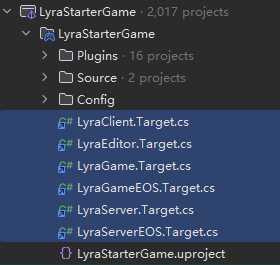
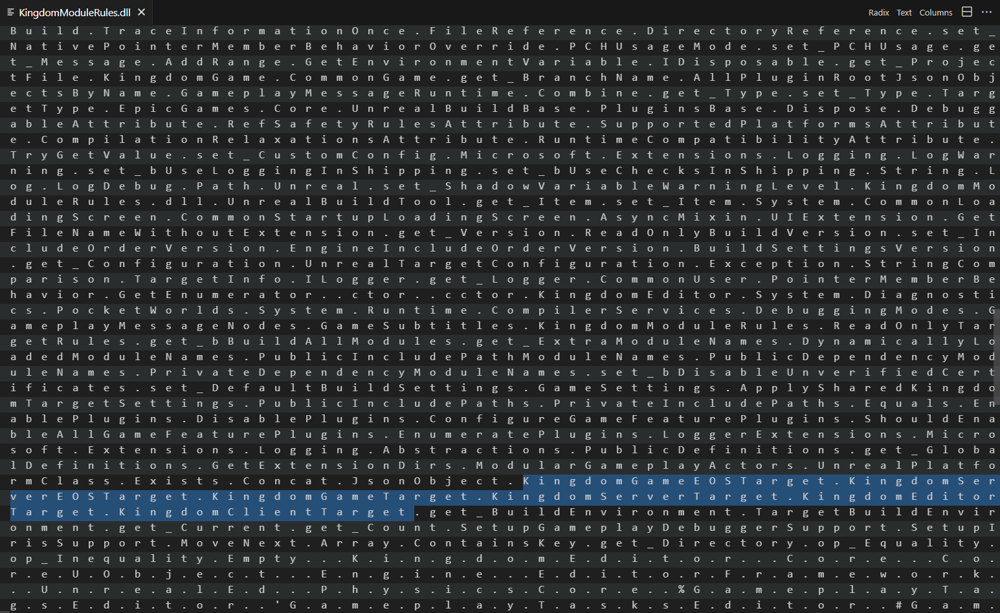
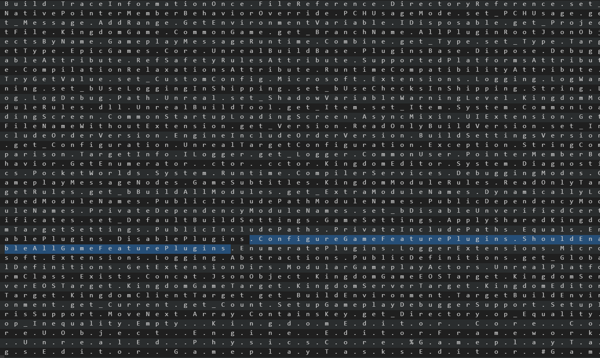
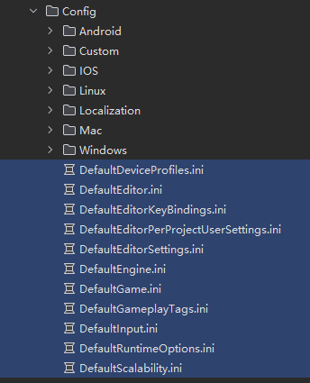
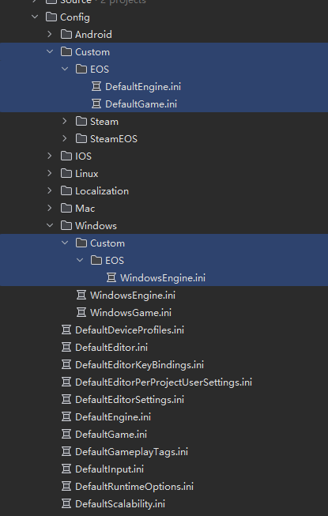



## Build Targets
Just by a quick glance at the project structure, we can see that Lyra has 6 different build targets. Each of them has a different purpose and can be used to build the project in different ways.

- LyraEditor
- LyraClient
- LyraServer
- LyraServerEOS
- LyraGame
- LyraGameEOS

{: width="400"}

We will go through each of them, but we will touch LyraGame last, as this is a larger file that contains a lot of information about the project. The other targets are much smaller and easier to digest.

## LyraEditor
Simple enough, the `LyraEditor` target is used to build the editor. It includes the `LyraGame` and `LyraEditor` modules, and it also enables the `RemoteSession` plugin for touch screen development. So this is something we could get rid of if we are not using touch screens.

```cs
// Copyright Epic Games, Inc. All Rights Reserved.

using UnrealBuildTool;
using System.Collections.Generic;

public class LyraEditorTarget : TargetRules
{
    public LyraEditorTarget(TargetInfo Target) : base(Target)
    {
        Type = TargetType.Editor;

        ExtraModuleNames.AddRange(new string[] { "LyraGame", "LyraEditor" });

        if (!bBuildAllModules)
        {
            NativePointerMemberBehaviorOverride = PointerMemberBehavior.Disallow;
        }

        LyraGameTarget.ApplySharedLyraTargetSettings(this);

        // This is used for touch screen development along with the "Unreal Remote 2" app
        EnablePlugins.Add("RemoteSession");
    }
}
```

### Target Type
The first line of the target is `Type = TargetType.Editor;`, this is a property of the `TargetRules` class, and it is used to specify the type of target we are building. The possible values are:

- Game
- Editor
- Client
- Server
- Program

```cpp
/// <summary>
/// Static class wrapping constants aliasing the global TargetType enum.
/// </summary>
public static class TargetType
{
    /// <summary>
    /// Alias for TargetType.Game
    /// </summary>
    public const global::UnrealBuildTool.TargetType Game = global::UnrealBuildTool.TargetType.Game;

    /// <summary>
    /// Alias for TargetType.Editor
    /// </summary>
    public const global::UnrealBuildTool.TargetType Editor = global::UnrealBuildTool.TargetType.Editor;

    /// <summary>
    /// Alias for TargetType.Client
    /// </summary>
    public const global::UnrealBuildTool.TargetType Client = global::UnrealBuildTool.TargetType.Client;

    /// <summary>
    /// Alias for TargetType.Server
    /// </summary>
    public const global::UnrealBuildTool.TargetType Server = global::UnrealBuildTool.TargetType.Server;

    /// <summary>
    /// Alias for TargetType.Program
    /// </summary>
    public const global::UnrealBuildTool.TargetType Program = global::UnrealBuildTool.TargetType.Program;
}
```

Most types are self explanatory, but the `Program` type is used to build standalone programs that are not part of the engine or the game. This is useful for building tools or utilities that are not part of the game itself. An example would be the `UnrealFrontend` tool.

```cs
// Copyright 1998-2018 Epic Games, Inc. All Rights Reserved.

using UnrealBuildTool;
using System.Collections.Generic;

public class UnrealFrontendTarget : TargetRules
{
    public UnrealFrontendTarget( TargetInfo Target ) : base(Target)
    {
        Type = TargetType.Program;
        LinkType = TargetLinkType.Modular;
        AdditionalPlugins.Add("UdpMessaging");
        LaunchModuleName = "UnrealFrontend";

        bBuildEditor = false;
        bCompileAgainstEngine = false;
        bCompileAgainstCoreUObject = true;
        bForceBuildTargetPlatforms = true;
        bCompileWithStatsWithoutEngine = true;
        bCompileWithPluginSupport = true;

        bHasExports = false;
    }
}
```

### Target Dependencies vs Global Dependencies
Normally, we would just enable a plugin in the `uproject` file, declare it as a dependency in the `Build.cs` file, and then we would be able to use it in code. It's almost a second nature to do this, however if we think about it, we really didn't need to have such global dependencies introduced in the first place if it only matters for some targets. Hence in the above example, we can specifically toggle a plugin for a specific target. in this case, the `RemoteSession` plugin is only enabled for the `LyraEditor` target since that's for touch screen development only.

> Note: in order to use plugin in code, we need to add it to the `Build.cs`, which will static link against the plugin source. But if we are just using the plugin's Blueprint assets, or other contents, then the UBT will dynamically link the plugin's `dll`. Which means enable the plugin in the project and link it in `Build.cs` are two different things. The plugin content will be cooked as long as `uproject` enabled it and depends on it.
{: .prompt-info }


### Cross Target Dependencies
The last line is quite exotic, which is a call to `LyraGameTarget.ApplySharedLyraTargetSettings(this);`. This is a method that is defined in the `LyraGame` target, and it is used to apply some shared settings to all targets. We will go through this method's implementation later, but for now, just know that it is used to apply some common settings to all targets.

#### How UBT performs it's magic?
But wait a second, what is this `LyraGameTarget` object? How come we are calling a function from it without even using (include) the header file? To answer this question, we need to understand how UBT works. We are not going to dive too deep into UBT, simply put:

- UBT collects all the `target.cs` files as well as the module files (`build.cs`) and compiles them into a single assembly.
  - This assembly is stored in the `Intermediate/Build/BuildRule/LyraModuleRules.dll` folder
  - Yes, all of them, including those from the plugins, include `server.target.cs`, `game.target.cs` into one single assembly.
  - That's why we can use `LyraGameTarget` without including the header file, because UBT has already compiled it into an assembly and `LyraEditor` knows `LyraGameTarget` existence.
  - Note that compiling all the targets into a single assembly doesn't mean that they are being built. When we build `LyraEditor.Target.cs`. It only will look `LyraGame.Build.cs` because it's listed as `ExtraModuleNames`. And `LyraServer.Target.cs` won't be built at all.

Even that, why are we able to call it directly? Where do we get the `LyraGameTarget` object from?

Answer is we don't, this function is a static function, and C# doesn't use the `::` operator to call static functions like C++ would, they are all called from a `.`.

```cs
internal static void ApplySharedLyraTargetSettings(TargetRules Target)
    {
        // ...
  }
```

The brief process is:
- `RulesCompiler` collects all the files and creates a single assembly target `RulesAssembly`, passing these files to it.
- `RulesAssembly` compiles the files and creates a single assembly that all other `Target.cs` can access during build.

I know, I also found it hard to believe, how come my `Client` target aware of my `ServerEOS` target while building? But here's the proof (Just stepping into the UBT should be easier, but I really want to see it with my own eyes), here's a decompiled version of the `ModuleRules.dll`



Indeed, everything is in this dll. Client, Editor, Server, Game, All the Plugins, etc. Everything, and here's more, we can see this `ConfigureGameFeaturePlugins` function in the dll as well.



And where is it in code? Here, inside the `LyraGameTarget` class, so this should be a good answer to our question.:

```cs
    // Configures which game feature plugins we want to have enabled
    // This is a fairly simple implementation, but you might do things like build different
    // plugins based on the target release version of the current branch, e.g., enabling 
    // work-in-progress features in main but disabling them in the current release branch.
    static public void ConfigureGameFeaturePlugins(TargetRules Target)
    {
        // ...
  }
```

## LyraClient
Same old, no fancy stuff here once we figured out the previous one.

```cs
// Copyright Epic Games, Inc. All Rights Reserved.

using UnrealBuildTool;
using System.Collections.Generic;

public class LyraClientTarget : TargetRules
{
    public LyraClientTarget(TargetInfo Target) : base(Target)
    {
        Type = TargetType.Client;

        ExtraModuleNames.AddRange(new string[] { "LyraGame" });

        LyraGameTarget.ApplySharedLyraTargetSettings(this);
    }
}
```

## LyraServer
New target, new rules, this one introducese a new property `bUseChecksInShipping` which is used to enable or disable checks in shipping builds. This is useful for debugging purposes, but it can also be used to enable or disable certain features in shipping builds.

```cs
// Copyright Epic Games, Inc. All Rights Reserved.

using UnrealBuildTool;
using System.Collections.Generic;

[SupportedPlatforms(UnrealPlatformClass.Server)]
public class LyraServerTarget : TargetRules
{
    public LyraServerTarget(TargetInfo Target) : base(Target)
    {
        Type = TargetType.Server;

        ExtraModuleNames.AddRange(new string[] { "LyraGame" });

        LyraGameTarget.ApplySharedLyraTargetSettings(this);

        bUseChecksInShipping = true;
    }
}
```

Some similar properties are:

```cs
public bool bUseLoggingInShipping = true ;
public bool bUseChecksInShipping = true ;

// Engine\Source\Runtime\Core\Public\Misc\ Build.h
#define ALLOW_CONSOLE_IN_SHIPPING 1
#define FORCE_USE_STATS 1
```

There are a LOT LOT more properties available, in fact, the auto generated document `UnrealBuildTool.xml` file has a wooping 32000 lines of contents. So I submitted it to this [Github Repo] for reference.

> Epic also has a [Giant Page] for the build configs available.
{: .prompt-info }

## LyraServerEOS & LyraGameEOS & CustomConfig
Almost there, these two targets are pretty simple at a glance, they inherit from their respective parent targets, `LyraServer` and `LyraGame`, and they only add a new property `CustomConfig` which is used to specify the custom config file to use for the target.

```cs
// Copyright Epic Games, Inc. All Rights Reserved.

using UnrealBuildTool;
using System.Collections.Generic;

public class LyraServerEOSTarget : LyraServerTarget
{
    public LyraServerEOSTarget(TargetInfo Target) : base(Target)
    {
        CustomConfig = "EOS";
    }
}


// Copyright Epic Games, Inc. All Rights Reserved.

using UnrealBuildTool;
using System.Collections.Generic;

public class LyraGameEOSTarget : LyraGameTarget
{
    public LyraGameEOSTarget(TargetInfo Target) : base(Target)
    {
        CustomConfig = "EOS";
    }
}
```

What the `CustomConfig` does is it tells the engine that we have a custom config file exists. And the target should jam it into the build process. The folder path is defined in the source below.

```cpp
inline FConfigLayer GConfigLayers[] =
{
    /**************************************************
    **** CRITICAL NOTES
    **** If you change this array, you need to also change EnumerateConfigFileLocations() in ConfigHierarchy.cs!!!
    **** And maybe UObject::GetDefaultConfigFilename(), UObject::GetGlobalUserConfigFilename()
    **************************************************/

    // ...
    // Project/Custom/CustomConfig/Default*.ini only if CustomConfig is defined
    { TEXT("CustomConfig"),                TEXT("{PROJECT}/Config/Custom/{CUSTOMCONFIG}/Default{TYPE}.ini"), EConfigLayerFlags::RequiresCustomConfig },
    // ...
};
```



As can be seen above, we have a lot of configs, aside from those that our class with `Config` meta specifier will read from, there are also a bunch of folders for each possible platform. And there's a `Custom` folder as well.

### Config Layers
Immediately, we found a problem. There seems to have multiple `Custom/EOS` folders, one just exists at the root and the other is inside the `Windows` folder, so which one is actually being used?



As mentioned in the [Config Documentation] and from source code, we can see that unreal reads config by the following order:

- Engine/Config/Base.ini
- Engine/Config/Base[Type].ini
- Engine/Config/[Platform]/Base[Platform][Type].ini
- [Project Directory]/Config/Default[Type].ini
- [Project Directory]/Config/Generated[Type].ini
- [Project Directory]/Config/Custom/[CustomConfig]/Default[Type].ini
- Engine/Config/[Platform]/[Platform][Type].ini
- [Project Directory]/Config/[Platform]/[Platform][Type].ini
- [Project Directory]/Config/[Platform]/Generated[Platform][Type].ini
- [Project Directory]/Config/[Platform]/Custom/[CustomConfig]/[Platform][Type].ini
- [User]/Unreal Engine/Engine/Config/User[Type].ini
- [Project Directory]/Config/User[Type].ini

```cpp
// See FConfigContext.cpp for the types here

inline FConfigLayer GConfigLayers[] =
{
	/**************************************************
	**** CRITICAL NOTES
	**** If you change this array, you need to also change EnumerateConfigFileLocations() in ConfigHierarchy.cs!!!
	**** And maybe UObject::GetDefaultConfigFilename(), UObject::GetGlobalUserConfigFilename()
	**************************************************/

	// Engine/Base.ini
	{ TEXT("AbsoluteBase"),				TEXT("{ENGINE}/Config/Base.ini"), EConfigLayerFlags::NoExpand},

	// Engine/Base*.ini
	{ TEXT("Base"),						TEXT("{ENGINE}/Config/Base{TYPE}.ini") },
	// Engine/Platform/BasePlatform*.ini
	{ TEXT("BasePlatform"),				TEXT("{ENGINE}/Config/{PLATFORM}/Base{PLATFORM}{TYPE}.ini")  },
	// Project/Default*.ini
	{ TEXT("ProjectDefault"),			TEXT("{PROJECT}/Config/Default{TYPE}.ini"), EConfigLayerFlags::AllowCommandLineOverride },
	// Project/Generated*.ini Reserved for files generated by build process and should never be checked in 
	{ TEXT("ProjectGenerated"),			TEXT("{PROJECT}/Config/Generated{TYPE}.ini") },
	// Project/Custom/CustomConfig/Default*.ini only if CustomConfig is defined
	{ TEXT("CustomConfig"),				TEXT("{PROJECT}/Config/Custom/{CUSTOMCONFIG}/Default{TYPE}.ini"), EConfigLayerFlags::RequiresCustomConfig },
	// Engine/Platform/Platform*.ini
	{ TEXT("EnginePlatform"),			TEXT("{ENGINE}/Config/{PLATFORM}/{PLATFORM}{TYPE}.ini") },
	// Project/Platform/Platform*.ini
	{ TEXT("ProjectPlatform"),			TEXT("{PROJECT}/Config/{PLATFORM}/{PLATFORM}{TYPE}.ini") },
	// Project/Platform/GeneratedPlatform*.ini Reserved for files generated by build process and should never be checked in 
	{ TEXT("ProjectPlatformGenerated"),	TEXT("{PROJECT}/Config/{PLATFORM}/Generated{PLATFORM}{TYPE}.ini") },
	// Project/Platform/Custom/CustomConfig/Platform*.ini only if CustomConfig is defined
	{ TEXT("CustomConfigPlatform"),		TEXT("{PROJECT}/Config/{PLATFORM}/Custom/{CUSTOMCONFIG}/{PLATFORM}{TYPE}.ini"), EConfigLayerFlags::RequiresCustomConfig },
	// UserSettings/.../User*.ini
	{ TEXT("UserSettingsDir"),			TEXT("{USERSETTINGS}Unreal Engine/Engine/Config/User{TYPE}.ini"), EConfigLayerFlags::NoExpand },
	// UserDir/.../User*.ini
	{ TEXT("UserDir"),					TEXT("{USER}Unreal Engine/Engine/Config/User{TYPE}.ini"), EConfigLayerFlags::NoExpand },
	// Project/User*.ini
	{ TEXT("GameDirUser"),				TEXT("{PROJECT}/Config/User{TYPE}.ini"), EConfigLayerFlags::NoExpand },
};
```

Which well explains how different `EOS` folders are being used, unreal first loads the `Custom/EOS` folder, and then it loads the `Windows/EOS` folder.

## `;` is NOT a comment?!
> This part is from Epic's documentation, however, I don't think it is the case anymore.
{: .prompt-warning }

From the above document, Epic has brought up a interesting topic, which is the `;` character, they mentioned it's almost an instinct to think that `;` is a comment, but in fact, it is not. The reason it "mostly" just work perfectly as a comment is because during the parsing process. `FConfigFile::ProcessInputFileContents` doesn't actually treat a line without a `=` sign that forms a key-value pair. So this line is skipped. As a result, if we somehow has:

```ini
;A = 1
```

Then we are actually defining a key-value pair of key `A` and value `1`. So this is a valid line, and it will be parsed as such.

BUT! here's what `FConfigFile::ProcessInputFileContents` looks like: Which clearly shows that it explicitly checks for `;` and ignores it. Which means that the above statement is not true.

```cpp
    // ...
    // ignore [comment] lines that start with ;
    if(*Start != (TCHAR)';')
    {
        // If we're in python mode and the line starts with whitespace
        // then we should consider it a part of the prior key
        if (File->bPythonConfigParserMode && !CurrentKeyName.IsNone() && FChar::IsWhitespace(*Start))
        {
            Value = Start;
        }
        else
        {
            Value = FCString::Strstr(Start,TEXT("="));
        }
    }

    // Ignore any lines that don't contain a key-value pair
    if( Value )
    {
        // ...
    }
```

## LyraGame and Shared Target Settings
We finally made it to the `LyraGame` target, with previous knowledge, the file shouldn't be too hard to understand, aside from normal target properties, it exposed a few more static functions for other targets to use. With that being said, the takeaway here is that we can centralize our common target settings in one place, and allow other targets to just use them, instead of duplicating the code everywhere.

An intersting thing here is that we can have a machine that set its the `IsBuildMachine` environment variable to `1`, and this will allow us to do something fancy only on that machine, great use for DevOps. This is useful for build machines that need to have all the plugins enabled for testing purposes.

```cs
// Copyright Epic Games, Inc. All Rights Reserved.

using UnrealBuildTool;
using System;
using System.IO;
using EpicGames.Core;
using System.Collections.Generic;
using UnrealBuildBase;
using Microsoft.Extensions.Logging;

public class LyraGameTarget : TargetRules
{
    public LyraGameTarget(TargetInfo Target) : base(Target)
    {
        Type = TargetType.Game;

        ExtraModuleNames.AddRange(new string[] { "LyraGame" });

        LyraGameTarget.ApplySharedLyraTargetSettings(this);
    }

    private static bool bHasWarnedAboutShared = false;

    internal static void ApplySharedLyraTargetSettings(TargetRules Target)
    {
    // ... See Appendix: ApplySharedLyraTargetSettings
    }

    static public bool ShouldEnableAllGameFeaturePlugins(TargetRules Target)
    {
        if (Target.Type == TargetType.Editor)
        {
            // With return true, editor builds will build all game feature plugins, but it may or may not load them all.
            // This is so you can enable plugins in the editor without needing to compile code.
            // return true;
        }

        bool bIsBuildMachine = (Environment.GetEnvironmentVariable("IsBuildMachine") == "1");
        if (bIsBuildMachine)
        {
            // This could be used to enable all plugins for build machines
            // return true;
        }

        // By default use the default plugin rules as set by the plugin browser in the editor
        // This is important because this code may not be run at all for launcher-installed versions of the engine
        return false;
    }

    private static Dictionary<string, JsonObject> AllPluginRootJsonObjectsByName = new Dictionary<string, JsonObject>();

    // Configures which game feature plugins we want to have enabled
    // This is a fairly simple implementation, but you might do things like build different
    // plugins based on the target release version of the current branch, e.g., enabling 
    // work-in-progress features in main but disabling them in the current release branch.
    static public void ConfigureGameFeaturePlugins(TargetRules Target)
    {
    // ... See Appendix: ConfigureGameFeaturePlugins
    }
}
```

## Appendix: `ApplySharedLyraTargetSettings`
```cs
internal static void ApplySharedLyraTargetSettings(TargetRules Target)
    {
        ILogger Logger = Target.Logger;
        
        Target.DefaultBuildSettings = BuildSettingsVersion.V5;
        Target.IncludeOrderVersion = EngineIncludeOrderVersion.Latest;

        bool bIsTest = Target.Configuration == UnrealTargetConfiguration.Test;
        bool bIsShipping = Target.Configuration == UnrealTargetConfiguration.Shipping;
        bool bIsDedicatedServer = Target.Type == TargetType.Server;
        if (Target.BuildEnvironment == TargetBuildEnvironment.Unique)
        {
            Target.ShadowVariableWarningLevel = WarningLevel.Error;

            Target.bUseLoggingInShipping = true;

            if (bIsShipping && !bIsDedicatedServer)
            {
                // Make sure that we validate certificates for HTTPS traffic
                Target.bDisableUnverifiedCertificates = true;

                // Uncomment these lines to lock down the command line processing
                // This will only allow the specified command line arguments to be parsed
                //Target.GlobalDefinitions.Add("UE_COMMAND_LINE_USES_ALLOW_LIST=1");
                //Target.GlobalDefinitions.Add("UE_OVERRIDE_COMMAND_LINE_ALLOW_LIST=\"-space -separated -list -of -commands\"");

                // Uncomment this line to filter out sensitive command line arguments that you
                // don't want to go into the log file (e.g., if you were uploading logs)
                //Target.GlobalDefinitions.Add("FILTER_COMMANDLINE_LOGGING=\"-some_connection_id -some_other_arg\"");
            }

            if (bIsShipping || bIsTest)
            {
                // Disable reading generated/non-ufs ini files
                Target.bAllowGeneratedIniWhenCooked = false;
                Target.bAllowNonUFSIniWhenCooked = false;
            }

            if (Target.Type != TargetType.Editor)
            {
                // We don't use the path tracer at runtime, only for beauty shots, and this DLL is quite large
                Target.DisablePlugins.Add("OpenImageDenoise");

                // Reduce memory use in AssetRegistry always-loaded data, but add more cputime expensive queries
                Target.GlobalDefinitions.Add("UE_ASSETREGISTRY_INDIRECT_ASSETDATA_POINTERS=1");
            }

            LyraGameTarget.ConfigureGameFeaturePlugins(Target);
        }
        else
        {
            // !!!!!!!!!!!! WARNING !!!!!!!!!!!!!
            // Any changes in here must not affect PCH generation, or the target
            // needs to be set to TargetBuildEnvironment.Unique

            // This only works in editor or Unique build environments
            if (Target.Type == TargetType.Editor)
            {
                LyraGameTarget.ConfigureGameFeaturePlugins(Target);
            }
            else
            {
                // Shared monolithic builds cannot enable/disable plugins or change any options because it tries to re-use the installed engine binaries
                if (!bHasWarnedAboutShared)
                {
                    bHasWarnedAboutShared = true;
                    Logger.LogWarning("LyraGameEOS and dynamic target options are disabled when packaging from an installed version of the engine");
                }
            }
        }
  }
```

## Appendix: `ConfigureGameFeaturePlugins`
```cs
    // Configures which game feature plugins we want to have enabled
    // This is a fairly simple implementation, but you might do things like build different
    // plugins based on the target release version of the current branch, e.g., enabling 
    // work-in-progress features in main but disabling them in the current release branch.
    static public void ConfigureGameFeaturePlugins(TargetRules Target)
    {
        ILogger Logger = Target.Logger;
        Log.TraceInformationOnce("Compiling GameFeaturePlugins in branch {0}", Target.Version.BranchName);

        bool bBuildAllGameFeaturePlugins = ShouldEnableAllGameFeaturePlugins(Target);

        // Load all of the game feature .uplugin descriptors
        List<FileReference> CombinedPluginList = new List<FileReference>();

        List<DirectoryReference> GameFeaturePluginRoots = Unreal.GetExtensionDirs(Target.ProjectFile.Directory, Path.Combine("Plugins", "GameFeatures"));
        foreach (DirectoryReference SearchDir in GameFeaturePluginRoots)
        {
            CombinedPluginList.AddRange(PluginsBase.EnumeratePlugins(SearchDir));
        }

        if (CombinedPluginList.Count > 0)
        {
            Dictionary<string, List<string>> AllPluginReferencesByName = new Dictionary<string, List<string>>();

            foreach (FileReference PluginFile in CombinedPluginList)
            {
                if (PluginFile != null && FileReference.Exists(PluginFile))
                {
                    bool bEnabled = false;
                    bool bForceDisabled = false;
                    try
                    {
                        JsonObject RawObject;
                        if (!AllPluginRootJsonObjectsByName.TryGetValue(PluginFile.GetFileNameWithoutExtension(), out RawObject))
                        {
                            RawObject = JsonObject.Read(PluginFile);
                            AllPluginRootJsonObjectsByName.Add(PluginFile.GetFileNameWithoutExtension(), RawObject);
                        }

                        // Validate that all GameFeaturePlugins are disabled by default
                        // If EnabledByDefault is true and a plugin is disabled the name will be embedded in the executable
                        // If this is a problem, enable this warning and change the game feature editor plugin templates to disable EnabledByDefault for new plugins
                        bool bEnabledByDefault = false;
                        if (!RawObject.TryGetBoolField("EnabledByDefault", out bEnabledByDefault) || bEnabledByDefault == true)
                        {
                            //Log.TraceWarning("GameFeaturePlugin {0}, does not set EnabledByDefault to false. This is required for built-in GameFeaturePlugins.", PluginFile.GetFileNameWithoutExtension());
                        }

                        // Validate that all GameFeaturePlugins are set to explicitly loaded
                        // This is important because game feature plugins expect to be loaded after project startup
                        bool bExplicitlyLoaded = false;
                        if (!RawObject.TryGetBoolField("ExplicitlyLoaded", out bExplicitlyLoaded) || bExplicitlyLoaded == false)
                        {
                            Logger.LogWarning("GameFeaturePlugin {0}, does not set ExplicitlyLoaded to true. This is required for GameFeaturePlugins.", PluginFile.GetFileNameWithoutExtension());
                        }

                        // You could read an additional field here that is project specific, e.g.,
                        //string PluginReleaseVersion;
                        //if (RawObject.TryGetStringField("MyProjectReleaseVersion", out PluginReleaseVersion))
                        //{
                        //        bEnabled = SomeFunctionOf(PluginReleaseVersion, CurrentReleaseVersion) || bBuildAllGameFeaturePlugins;
                        //}

                        if (bBuildAllGameFeaturePlugins)
                        {
                            // We are in a mode where we want all game feature plugins, except ones we can't load or compile
                            bEnabled = true;
                        }

                        // Prevent using editor-only feature plugins in non-editor builds
                        bool bEditorOnly = false;
                        if (RawObject.TryGetBoolField("EditorOnly", out bEditorOnly))
                        {
                            if (bEditorOnly && (Target.Type != TargetType.Editor) && !bBuildAllGameFeaturePlugins)
                            {
                                // The plugin is editor only and we are building a non-editor target, so it is disabled
                                bForceDisabled = true;
                            }
                        }
                        else
                        {
                            // EditorOnly is optional
                        }

                        // some plugins should only be available in certain branches
                        string RestrictToBranch;
                        if (RawObject.TryGetStringField("RestrictToBranch", out RestrictToBranch))
                        {
                            if (!Target.Version.BranchName.Equals(RestrictToBranch, StringComparison.OrdinalIgnoreCase))
                            {
                                // The plugin is for a specific branch, and this isn't it
                                bForceDisabled = true;
                                Logger.LogDebug("GameFeaturePlugin {Name} was marked as restricted to other branches. Disabling.", PluginFile.GetFileNameWithoutExtension());
                            }
                            else
                            {
                                Logger.LogDebug("GameFeaturePlugin {Name} was marked as restricted to this branch. Leaving enabled.", PluginFile.GetFileNameWithoutExtension());
                            }
                        }

                        // Plugins can be marked as NeverBuild which overrides the above
                        bool bNeverBuild = false;
                        if (RawObject.TryGetBoolField("NeverBuild", out bNeverBuild) && bNeverBuild)
                        {
                            // This plugin was marked to never compile, so don't
                            bForceDisabled = true;
                            Logger.LogDebug("GameFeaturePlugin {Name} was marked as NeverBuild, disabling.", PluginFile.GetFileNameWithoutExtension());
                        }

                        // Keep track of plugin references for validation later
                        JsonObject[] PluginReferencesArray;
                        if (RawObject.TryGetObjectArrayField("Plugins", out PluginReferencesArray))
                        {
                            foreach (JsonObject ReferenceObject in PluginReferencesArray)
                            {
                                bool bRefEnabled = false;
                                if (ReferenceObject.TryGetBoolField("Enabled", out bRefEnabled) && bRefEnabled == true)
                                {
                                    string PluginReferenceName;
                                    if (ReferenceObject.TryGetStringField("Name", out PluginReferenceName))
                                    {
                                        string ReferencerName = PluginFile.GetFileNameWithoutExtension();
                                        if (!AllPluginReferencesByName.ContainsKey(ReferencerName))
                                        {
                                            AllPluginReferencesByName[ReferencerName] = new List<string>();
                                        }
                                        AllPluginReferencesByName[ReferencerName].Add(PluginReferenceName);
                                    }
                                }
                            }
                        }
                    }
                    catch (Exception ParseException)
                    {
                        Logger.LogWarning("Failed to parse GameFeaturePlugin file {Name}, disabling. Exception: {1}", PluginFile.GetFileNameWithoutExtension(), ParseException.Message);
                        bForceDisabled = true;
                    }

                    // Disabled has priority over enabled
                    if (bForceDisabled)
                    {
                        bEnabled = false;
                    }

                    // Print out the final decision for this plugin
                    Logger.LogDebug("ConfigureGameFeaturePlugins() has decided to {Action} feature {Name}", bEnabled ? "enable" : (bForceDisabled ? "disable" : "ignore"), PluginFile.GetFileNameWithoutExtension());

                    // Enable or disable it
                    if (bEnabled)
                    {
                        Target.EnablePlugins.Add(PluginFile.GetFileNameWithoutExtension());
                    }
                    else if (bForceDisabled)
                    {
                        Target.DisablePlugins.Add(PluginFile.GetFileNameWithoutExtension());
                    }
                }
            }

            // If you use something like a release version, consider doing a reference validation to make sure
            // that plugins with sooner release versions don't depend on content with later release versions
        }
    }
```

[Github Repo]: https://github.com/reforia/UnrealGeneratedDoc/blob/main/UnrealBuildTool.xml
[Giant Page]: https://dev.epicgames.com/documentation/en-us/unreal-engine/build-configuration-for-unreal-engine?application_version=5.5
[Config Documentation]: https://dev.epicgames.com/documentation/en-us/unreal-engine/configuration-files-in-unreal-engine?application_version=5.0