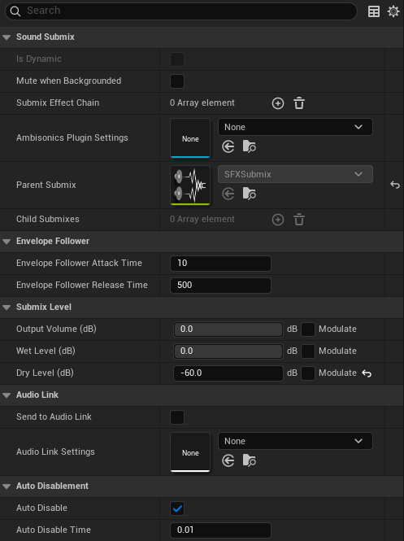
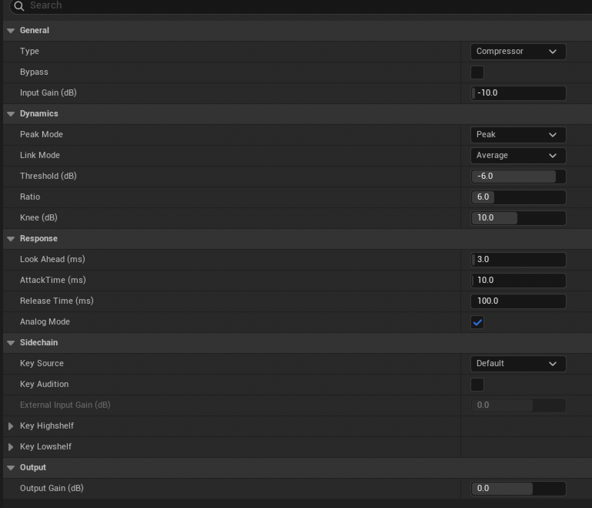
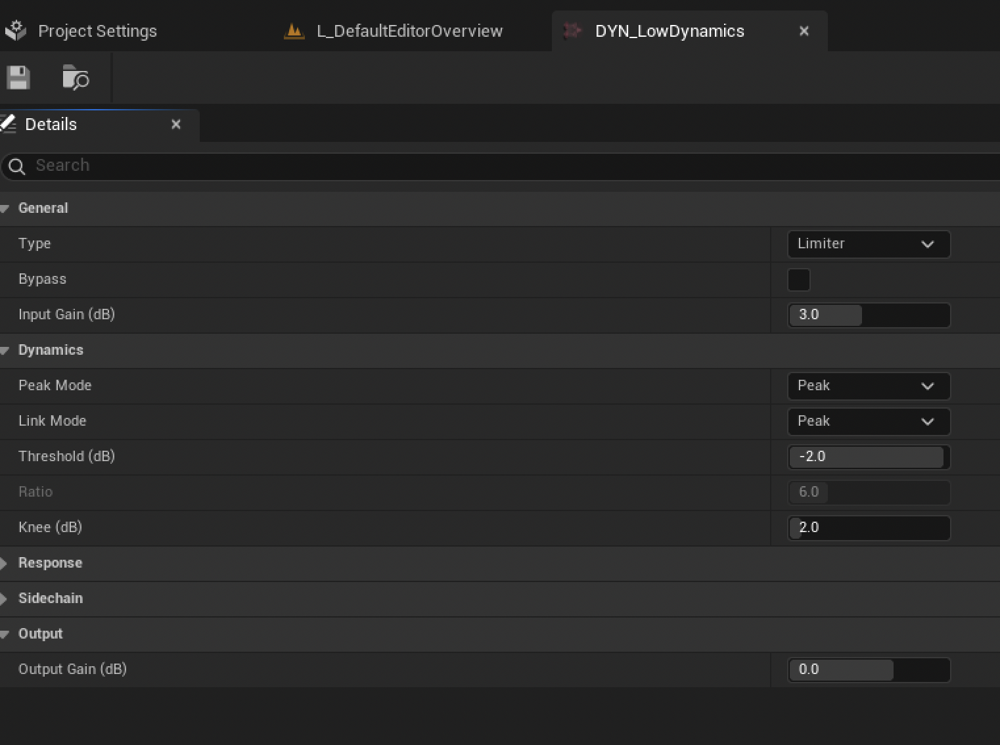





> This is a series of notes about what I've learned from Epic's Lyra project. Which claim to be the best practices under current unreal engine framework. Some I don't know about, some I already know but I thought it would still be good noting down.
{: .prompt-info }

> I am not an expert in audio, so this post will be more of a summary of what I have learned from the Lyra project for my understanding. It could very likely be wrong at some aspects. Please take it with a grain of salt.
{: .prompt-warning }

## Audio structure in Unreal 5
Unlike what we used to see in UE4, which only have some basic built in features like `sound cues`, `sound classes`, and `sound mix`, without any proper `DSP` graph. Pretty much the heavy lifting is done by sending events to another audio engine, like `Wwise`, `FMOD`, etc. In UE5, the new audio engine is built-in, and it has a proper `DSP` graph which is called `MetaSound`. The audio system is more flexible and powerful, allowing for complex audio processing and manipulation.

The overall flow of the audio signal can be illustrated as follows:
- `Sound Source` Generates the dry signal
  - `Sound Wave`, `Sound Cue`, `MetaSound`, they produce the raw audio signal
- Mixing system mixes the dry signal to wet signal
  - `Sound Class`, `Sound Mix`, `MetaSound Patch` have done the first stage of processing, usually we categorize sound assets into different classes, and then the class will be mapped to a `Submix` class.
  - `Submix`, `Submix Effect Chains`, etc, they are there to determine how the audio signal are being processed and mixed together
- Modulation
  - `Control Bus`, `Control Bus Mix`, `Parameter Patch` are used to modulate the wet signal we've mixed 
- Output to the output device
  - Eventually, the `Main Submix` will output the final audio signal to the output device, such as speakers or headphones.

## Sound Source
The first part is Sound Source, they are where the raw signal comes from. we have three types of sound sources in Lyra:
- `SoundWave`: The most basic sound source, it is a raw audio file, stored in 16-bit `WAV` format. It can be played back directly, but it doesn't have any processing or manipulation applied to it.
- `SoundCue`: A more advanced sound source, it is a container for multiple `SoundWave` assets. It allows for more complex audio processing and manipulation, such as randomization, looping, and fading.
- `MetaSound Source`: The most advanced sound source, it is a fully programmable audio engine that allows for complex audio processing and manipulation. It can be used to create custom audio effects, such as reverb, delay, and distortion.

But here's a bit more about it.

### MetaSounds Patch
A `MetaSound Source` can contain a lot of nodes, much alike a `Material` graph, and as a full functional `DSP` engine, a numerous amount of logic can be applied to the audio signal. So it's not a crazy idea to have some logic predefined as "Libraries" and when we need to use them, we can just jam them into the graph. This is where `MetaSound Patch` comes in, it is a collection of nodes that can be reused in different `MetaSound Source`. It is similar to a function library, but for audio processing.

Existing `MetaSound Patch` in Lyra:
- `lib_StereoBalance`
  - It has a `StereoPanner` node that will pan the audio signal to the left or right channel.
- `lib_DovetailClip`
  - It's trying to mix the previous audio signal with the new one with the already playing results together, with a Stereo Balance node in the end.
  - This also means that: `metasound` node, unlike material node, has it's own state. It's life time spans as long as the `metasound` exist, and will keep all the variables state in memory.
- `lib_DovetailClipFromArray`
  - Similarly, it allows to select wave from an array, and then apply the `DovetailClip` effect to it.
- `lib_RandInterpTo`
  - Gradually interpolate to a random value.
- `lib_RandPanStereo`
  - Return a random stereo pan value for left and right channel individually
- `lib_TriggerAfter`
  - Trigger once after n counts
- `lib_TriggerEvery`
  - Trigger every count, but only return true for the 1st count, so if we set the reset count to be 4, we will receive 
    - `true` (count = 1)
    - `false` (count = 2)
    - `false` (count = 3)
    - `false` (count = 4)
    - `true` (count = 1, because it's been reset)
    - so on and so forth.
  - Note that count does not equal to the actual value, we can have a trigger counter node with initial value of 0 and step of 1, we will actually have
    - value = 0 (count 1)
    - value = 1 (count 2)
    - value = 2 (count 3)
    - value = 3 (count 4, the reset count)
    - value = 0 (count 1)
    - ...
- `lib_TriggerModulo`
  - Similarly, trigger when the counter reaches the modulo of set n reaches 0
- `lib_TriggerStopAfter`
  - Only triggers until the set n counts, so if we set the n to be 4, this logic will only trigger 4 times and stop
- `lib_Whizby`
  - Whizby sound is the sound when a bullet is shot at us and fly aside closely, the sound will contain two parts, the incoming part and the receding part, what this lib does is when triggered, it plays a random incoming sound with random pitch shift, and delay a bit to play a random receding sound to mimic the bullet fly passed us
- `MS_Graph_RandomPitch_Stereo`
  - Output a stereo sound with a random pitch shift to the input wave asset
- `MS_Graph_TriggerDelayPitchShift_Mono`
  - Output a mono sound with a random delay and pitch shift to the input wave asset
- `mx_PlayAmbientElement`
  - Play a random ambient sound with a random initial delay from a given array, also stereo balanced before output.
- `mx_PlayAmbientChord`
  - Calls two `mx_PlayAmbientElement` and add them together. (Yes, add them together, makes the ambient louder or softer based on their phase)
- `mx_Stingers`
  - It's quite a brutal force implementaion to me, when the trigger `OnStingerPositive` is fired in music system, the `mx_Stingers` will try to fire 5 sound clips and mix them together, each representing a type:
    - bass
    - perc-deep
    - perc-light
    - short-pad
    - wet-lead
- `sfx_BaseLayer_Interactable_Pad_nl_meta`
  - It's a wrapper of `sfx_Random_nl_meta`, and that's it. Why not just make `sfx_Random_nl_meta` a metasound patch you might ask? I've no idea, ask Epic.
  - `sfx_Random_nl_meta` plays a random sound in given array. With a configurable weight and gain befor output
  - Any graph calling this node will result in a code assert indicating the lib is broken, so... this one doesn't look like a best practice to me.

## Mixing
Now we have all the sound sources out of the way. It's time to mix them. Mixing essentially is just "mix" multiple playing sounds together to one output. But there's a bit more on that, say we have audio A and B, the mixing is not just `MixAB = A + B`, instead `MixAB = f(A) + f(B)`. It also include the process to modify the raw audio signal, like make dry sound to a wet sound, envelop a sound, add EQ, LPF, HPF, and other effects to produce the `f(x)`, then combine them together in a harmonic way, that's why this part can get very time consuming and complex.

A lot of the mixings can already been done in metasound DSP graph alone. But there's a few more systems to help

### Sound Class
As mentioned before, this is a UE4 legacy feature, normally a sound source will be assigned to one sound class, like Music Class, SFX Class, etc. It was mainly used with Sound Mix in UE4 to do passive ducking (ducking is a process to lower the volume of channel A based on channel B, like ducking down music channel when sfx channel is playing) In UE5, it can still be used this way, yet we also have two new powerful features:
- Send the signal to a `Submix`
- Modulate the signal dynamically

This section will focus on `Submix` first

> Note that when using passive ducking sound mix, it will just alter the original signal, meaning `Sound Mix` would have higher priority than `Submix`, if we already ducked a sound down to -60db via `Sound Mix`, and we send 100% of it to a `Submix`, the `Submix` essentially just receives a flat, non audible signals.
{: .prompt-info }

### Submix
`Submix` is a signal operation concept, imagine we have weapon, footstep, ambience and musics raw files, they are usually just `wav` raw files, then being wrapped up either in `SoundCue` or `metasound` class and do some processing there. (As known as per sound processing) It will also be quite helpful if we can say, OK, now I want these sounds to be grouped together, and we will add a shared effect like `EQ` to all of them, a shared treatment. This is where `Submix` comes in, any sound source, or sound class, can be sent to a `Submix` partially or fully, and the `Submix` will have a `SubmixEffectChain` applied to it. And different `Submix` can orchestrate together, eventually feed to the `MainSubmix`, and output from there.

It's important to note that the `Submix` only took a copy of the original signals. So like if we have a music playing, and send 100% of it to a `Mute Submix`, it will still be audible, since we are hearing a mix of the original music and a mix of "nothing", so it's still the original music.

This unintuitive behavior could potentially lead to problems, so normally we might want to only output our processed wet signal, while mute all the dry sounds. (Normally, depends on project direction, it's also normal a portion of sound will be send to reverb) But for lyra, all dry audios are being muted.

{: .width="700"}

As mentioned before, we can send a portion of the original dry sound to submix, like 0.2 means we took 20% of the orignal wave signal amplitude, and apply a submix effect like EQ to them, and then they are mixed together when playback.

{: .width="700"}


### FLyraSubmixEffectChainMap
We have to touch a bit of the source code, here we have a struct which binds a `Submix` class to a `USoundEffectSubmixPreset`, so that we can easily define which `Submix` would have what kind of `SubmixPresets`, the reason it's called `SubmixEffectChain` is because it's an array, meaning we can have multiple `SubmixPresets` applied for a single `Submix`. Just like `EQ`, `LPF`, etc

```cpp
USTRUCT()
struct LYRAGAME_API FLyraSubmixEffectChainMap
{
	GENERATED_BODY()

	UPROPERTY(EditAnywhere, meta = (AllowedClasses = "/Script/Engine.SoundSubmix"))
	TSoftObjectPtr<USoundSubmix> Submix = nullptr;

	UPROPERTY(EditAnywhere, meta = (AllowedClasses = "/Script/Engine.SoundEffectSubmixPreset"))
	TArray<TSoftObjectPtr<USoundEffectSubmixPreset>> SubmixEffectChain;

};
```

### HDR and LDR
A good example here is `HDR` and `LDR`, in a nutshell, players might have different audio output devices, some are fancy high-end devices, some are just cheap ones, the listening experience will differ from headphone and TV as well, the player might also just prefer one over another, or want to enable night mode. Anyway, we need to have different audio settings for different devices. The `AudioSettings` class has two properties for this purpose, `HDRAudioSubmixEffectChain` and `LDRAudioSubmixEffectChain`, which are both arrays of `FLyraSubmixEffectChainMap`. And we need to have a mechanic to switch them based on a setting that the player can config in a settings UI.

To accommodate this feature, the logic behind is:
- Having a mechanic for the user to config whether we should output `HDR` or `LDR` audio
- For all the sound output, we will apply a series of "Post-Process" (`SubmixEffectChain`) effect to achieve this.

The first part should be related to a UI, once UI reports the user has confirmed a preferred mode, we will have a way to operate all the sound outputs, this is where we need to utilize `Submix`

### Dynamic Submix Effects
But here's a problem: A `Submix` can just configure it's own `SubmixEffectChain` directly, so what's the whole point of wrapping it to `FLyraSubmixEffectChainMap` again?

The answer is: in this case, the struct is really just used for `HDRAudioSubmixEffectChain` and `LDRAudioSubmixEffectChain`, despite the struct seems to be for generic purpose. The other `Submix`es were just directly applying their own `SubmixEffectChain` in the `Submix` asset.

{: width="800" }

As can be seen above, only the `MainSubmix` is being further processed, and the reason why we are doing this is also obvious, whether we apply `HDR` or `LDR` is defined at runtime, and normal `SubmixEffectChain` configured in `Submix` class is static.

### HDR Effect
HDR effect is a compressor type, it has a `-10db` input gain to shift the signal down to provide more headroom, and a `-6db` threshold to kick in the compressor. So that more dynamic range can be preserved. The logic behind this is, we try to keep as much sound as possible, and only smoothly compress the sounds that are too loud. It tries to keep the emotion and vividness of the experience, even though sounds might be hard to distinguish sometimes. Usually for a cinematic setup experience.

{: width="800" }

After the sound was shift down by 10db as input gain, it checks the peak sound using average mode (get the average of left and right channel input). bypassing `-6db`, we will apply a `6:1` ratio, meaning the output source will increase 1db for every `6db` of input source. This might sounds weird if it cuts off the sound too drastically, so that's where the knee and lookahead comes, look ahead allows us to delay the sound a bit so we can monitor the "Future" signal and act ahead of time. Knee is basically saying, although we are using `-6db` as threshold, but within the `+-knee` value range, our compressor can gradually kick in, make the transition smoother.

Just like normal envelop effect, we also have attack and release time for compressor. It also has a sidechain input, which is saying, when the sidechain input is playing above the threshold, we will give a gain or cutoff to the current output signal, just like a ducking effect.

### LDR Effect
Very similar to `HDR`, except this time it's a limiter type, which means we are trying to limit the sound by cutting off the sound if it exceeds threshold. The logic behind this is, we want to make sure that the sound doesn't exceed a certain level at all cost, so that it won't clip or distort. The intention is to keep the sound as clean and consistent as possible, even though it might sound a bit flat sometimes. Usually for a TV or speaker setup experience.

{: width="800" }

### Available Submix
{: width="800" }

Above is the Submix Structure in Lyra, a bunch of `Submix`es eventually being routed to `MainSubmix`
- `UISubmix`
- `SFXSubmix`
- `MusicSubmix`
- `SendEffectSubmix`
- `ReverbSubmix`
- `VoiceSubmix`
- `EarlyReflectionSubmix`

### Sound Attenuation
Sound Attenuation represents the sound propagation in the environment, it can be used to simulate the distance and direction of the sound source. It can also be used to simulate the effect of walls and other obstacles on the sound. 

`Sound Cue` or `Meta Sound` Source will reference `Sound Attenuation Presets`

#### Attenuation Presets
The attenuation preset is usually defined by a set of parameters, such as:
- `Volume`
  - The falloff of the sound in a volume over distance
- `Spatialization`
  - The location of the sound in 3D space, achieved by panning the sound to the left or right channel
- `Air Absorption`
  - Based on the distance and the frequency of the sound, the sound will be absorbed by the air, and the higher the frequency, the more it will be absorbed
- `Focus`
  - The sound in the camera focus will have higher priority and more stand out
- `Reverb`
  - The sound will be affected by the reverb in the environment, such as the size and shape of the room, the materials of the walls, etc
- `Occlusion`
  - The sound will be affected by the occlusion of the environment, such as walls and other obstacles, it will also affect the high frequency of the sound due to material absorption
- `Priority`
  - The priority of the sound, which will determine how the sound is mixed with other sounds in the environment
- `Submix`
  - Allow sending the sound to a `Submix` for further processing

#### ITD Source Spatialization Settings
`Attenuation Presets` can reference `ITD specialization settings` as a more advanced way to control the panning algorithm based on distance and direction of the sound source. It can be used to simulate the effect of the sound source moving in 3D space, such as a car passing by or a person walking around.

{: width="700" }

### Concurrency
`Sound Source` can reference `Concurrency Settings`, this is a way to control how many sounds can be played at the same time, and cut off sounds if they exceeds a certain limit. It can be used to simulate the effect of multiple sounds playing at the same time, such as a crowd or a busy street.

{: width="700" }

The default policy is `Farthest then Oldest`, which means the sound will be cut off based on the distance first, and then the oldest sound will be cut off if the distance is the same. The other policies are:
- `PreventNew`
- `StopOldest`
- `StopFarthestThenPreventNew`
- `StopLowestPriority`
- `StopQuietest`
- `StopLowestPriorityThenPreventNew`

### Effects
Lyra has a few built in effects, these are types of `SubmixEffect`, which are used for `SubmixEffectChain` in `Submix`. They are used to process the audio signal in a certain way, such as adding `reverb`, `delay`, or `distortion`. The effects can be used to create a certain mood or atmosphere in the game, such as making the sound more immersive or realistic.

#### Convolution Reverb
`Convolution Reverb` is an advanced reverb effect using a `IR (Impulse Response)` asset, which is created from a wav file, it bascially captures the spatial representation, include material, early reflection, energy air absorption, etc through analysis of the recorded pop sound wave. To guide the input sound source how to behave as if it was in that space.

Official Documentation: [Convolution Reverb]

However, in Lyra, the `Convolution Reverb` is being used in `ReverbSubmix`, but the `ReverbSubmix` is not being used anywhere either. So it's a bit of a mystery why it's there. I guess it might for contents in Game Feature plugins.

#### Audio Impulse Response
Create a new `Audio Impulse Response` asset is simple, just right click a recorded `wav` file in the content browser and select `Create Audio Impulse Response` and it will generate a new asset for us. 

Note that the `wav` file must be a stereo file and ideally a short one, like 1-2 seconds of a pop sound, it should have a clear full energy peak, and then decay down to silence, these info will be used to calculate the IR for reverb.

{: width="700" }

#### Dynamics Process
This is already covered in the `HDR` and `LDR` section.

#### Effect Filter
The filter effect is used to filter the audio signal based on a certain frequency range.


The filter types include:
- low pass
  - The low pass filter allows the low frequency to pass through and cuts off the high frequency, it can be used to create a muffled sound or a low rumble sound
- high pass
  - The high pass filter allows the high frequency to pass through and cuts off the low frequency, it can be used to create a bright sound or a high pitch sound
- band pass
  - The band pass filter allows a certain frequency range to pass through and cuts off the rest, it can be used to create a specific sound or a resonant sound
- band stop
  - The band stop filter cuts off a certain frequency range and allows the rest to pass through, it can be used to create a specific sound or a resonant sound

#### Effect Tap Delay
The tap delay effect is used to create a delay effect on the audio signal, it can be used to create echoes or reverberation effects. In Lyra, there're 8 taps configured in `TAP_EarlyReflection`, they are all muted by default, and then the `WeaponAudioFunctions` will be responsible for updating the taps value based on the raycast results from a firing event.

### Early Reflection
In Lyra, the `SubmixEffectTapDelay` and `SubmixEffectFilter` are all used in the `EarlyReflection` system. An early reflection is a sound that arrives at the listener's ears after a short delay, it can be used to create a sense of space and depth in the sound. Everytime when the gunfire happens, it will shot out a serious of raycasts, and a few bounce rays, and determine the space based on the ray travel distance and energy absorption.

{: width="800" }

The two filter has prameter configured to:
- HPF cutoff frequency = 300hz
- LPF cutoff frequency = 10000hz

So that's equivalanet to clamp the sound between `300hz` and `10khz`, which is the human voice range.
{: width="800" }

#### Multiband Compressor
There's also a `low multiband compressor` exist but not being refererenced, it is used to compress the audio signal based on a certain frequency range. The `multiband compressor` has 4 bands ranging from `2.5khz` to `20khz`, and each band has its own `threshold`, `ratio`, `attack`, and `release time`.


## Modulation
It's a good time to review what we've covered so far. The whole audio process can be briefly described as:
- We give each sound a `sound class` to group them together, like `music`, `sfx`, `footsteps`, `ambient`, etc.
- We can have `sound mix` as passive ducking on classes, that's the unreal 4 way. It works for simpler needs but not really used in lyra
- Instead, they were being sent to `Submix` for further processing.
- Then, the volume of each sound is further modulated from a `Parameter Patch class (PP)`
- A `PP` class would mapping (multiply) multiple control buses's input value together, and produce one value out. Read by the `sound class`, to control the sounds in that class
- A `control bus` contains a parameter, so it effectively act like the knob or fader on a mixing panel for audio engineers. The only question left is, who is actually fading it?
- A lot of them, if we specifically want to change a `CB`, we can change it directly in `C++` or `BP`. If we want to have a preset, that will control multiple `CB`s based on certain scenario like boss fight, we can use `Control Bus Mix`, it can be activate or deactivated in C++ or blueprint as well.

#### Control Bus
`Control Bus` is not that complicated, it is a class that contains a parameter, and the parameter can be used to modulate the audio signal. The `control bus` can be used to control the `volume`, `pitch`, and other properties of the audio signal.

{: width="700" }

#### Control Bus Mix
Like mentioned before, `Control Bus Mix` is a collection of operations to each control bus, so it's used to control multiple `control buses` at the same time. However, this doesn't mean once we've set a `control bus mix`, we can't change the control bus value anymore. Both method co-exist with each other.

{: width="700" }

#### Parameter Patch
The relationship of different mixes can be controlled by a `Parameter Patch`, which is a class that contains a collection of `control buses` and a collection of `parameters`.

For example, we can have a `PP_Music` to mix `CB_Main` Volume with `CB_Music` volume. User can adjust Main volume in settings, but they could also change the music volume specifically. So we can think `CBM` as a master panel, and it will proportionally adjust the `control bus` values when dialed up or down. The individual `control bus` will then precisely control the parameter for that specific bus alone.

{: width="700" }

## AudioSettings
We will go back to source code again. Inspecting the `AudioSettings` class, we can see that it only has a meaningful header file, while the `cpp` file is empty. The file itself is quite simple and we've covered most of the tricks in previous posts. Just a refresher:

- We need to have our settings class inherit from `UDeveloperSettings` to be auto discovered by the engine.
- Class Meta Specifier `config = Game, default config, meta = (DisplayName = "LyraAudioSettings")`
  - The content in this class will be saved in a config file, type is default game (`DefaultGame.ini`), and the section is `LyraAudioSettings`
- Property Meta Specifier `config, EditAnywhere, Category = MixSettings, meta = (AllowedClasses = "/Script/AudioModulation.SoundControlBusMix")`
  - The property will be saved in the config file mentioned above.
  - The property is editable on archetype, or instances
  - The property will be categorized to `MixSetting`
  - The property only accept class is `SoundControlBusMix` from the `AudioModulation` plugin.

{: width="700" }

```cpp
// ...
USTRUCT()
struct LYRAGAME_API FLyraSubmixEffectChainMap
{
	GENERATED_BODY()

	UPROPERTY(EditAnywhere, meta = (AllowedClasses = "/Script/Engine.SoundSubmix"))
	TSoftObjectPtr<USoundSubmix> Submix = nullptr;

	UPROPERTY(EditAnywhere, meta = (AllowedClasses = "/Script/Engine.SoundEffectSubmixPreset"))
	TArray<TSoftObjectPtr<USoundEffectSubmixPreset>> SubmixEffectChain;

};

UCLASS(config = Game, defaultconfig, meta = (DisplayName = "LyraAudioSettings"))
class LYRAGAME_API ULyraAudioSettings : public UDeveloperSettings
{
	GENERATED_BODY()

public:

	/** The Default Base Control Bus Mix */
	UPROPERTY(config, EditAnywhere, Category = MixSettings, meta = (AllowedClasses = "/Script/AudioModulation.SoundControlBusMix"))
	FSoftObjectPath DefaultControlBusMix;

	/** The Loading Screen Control Bus Mix - Called during loading screens to cover background audio events */
	UPROPERTY(config, EditAnywhere, Category = MixSettings, meta = (AllowedClasses = "/Script/AudioModulation.SoundControlBusMix"))
	FSoftObjectPath LoadingScreenControlBusMix;

	/** The Default Base Control Bus Mix */
	UPROPERTY(config, EditAnywhere, Category = UserMixSettings, meta = (AllowedClasses = "/Script/AudioModulation.SoundControlBusMix"))
	FSoftObjectPath UserSettingsControlBusMix;

	/** Control Bus assigned to the Overall sound volume setting */
	UPROPERTY(config, EditAnywhere, Category = UserMixSettings, meta = (AllowedClasses = "/Script/AudioModulation.SoundControlBus"))
	FSoftObjectPath OverallVolumeControlBus;

	/** Control Bus assigned to the Music sound volume setting */
	UPROPERTY(config, EditAnywhere, Category = UserMixSettings, meta = (AllowedClasses = "/Script/AudioModulation.SoundControlBus"))
	FSoftObjectPath MusicVolumeControlBus;

	/** Control Bus assigned to the SoundFX sound volume setting */
	UPROPERTY(config, EditAnywhere, Category = UserMixSettings, meta = (AllowedClasses = "/Script/AudioModulation.SoundControlBus"))
	FSoftObjectPath SoundFXVolumeControlBus;

	/** Control Bus assigned to the Dialogue sound volume setting */
	UPROPERTY(config, EditAnywhere, Category = UserMixSettings, meta = (AllowedClasses = "/Script/AudioModulation.SoundControlBus"))
	FSoftObjectPath DialogueVolumeControlBus;

	/** Control Bus assigned to the VoiceChat sound volume setting */
	UPROPERTY(config, EditAnywhere, Category = UserMixSettings, meta = (AllowedClasses = "/Script/AudioModulation.SoundControlBus"))
	FSoftObjectPath VoiceChatVolumeControlBus;

	/** Submix Processing Chains to achieve high dynamic range audio output */
	UPROPERTY(config, EditAnywhere, Category = EffectSettings)
	TArray<FLyraSubmixEffectChainMap> HDRAudioSubmixEffectChain;
	
	/** Submix Processing Chains to achieve low dynamic range audio output */
	UPROPERTY(config, EditAnywhere, Category = EffectSettings)
	TArray<FLyraSubmixEffectChainMap> LDRAudioSubmixEffectChain;
    // ...
};
```

## Available Settings
Current available settings in Lyra are:
- `DefaultControlBusMix`
- `LoadingScreenControlBusMix`
- `UserSettingsControlBusMix`
- `OverallVolumeControlBus`
- `MusicVolumeControlBus`
- `SoundFXVolumeControlBus`
- `DialogueVolumeControlBus`
- `VoiceChatVolumeControlBus`

## Applications
We've gone through the audio system far enough, now there's only a few scattered system left.

> Nothing is better than the auther of these systems to explain how they work here. [Lyra Audio System]
{: .prompt-info }

### Music Manager Component
[Lyra Audio System] has well explained the music system, it is located in a metasound class called `mx_system`. It was being wrapped up in a component so that different game features can operate on it, like trigger fire stingers.

Since game feature is loading components to target object at runtime, it's a natural thing to make it a component. The component will be injected to `PlayerState`. And the music system did the following:
- Manage Combat Intensity, firing and combating behavior will increase the intensity, and it will decay over time
- When the intensity is high enough, it will enter combat mode, and the music will be softer to allow gunfire sound to be heard
- When the intensity is low enough, it will enter exploration mode, and the music will be louder and switch to a more ambient sound
- It would also update look direction of the player, though I didn't find any usage of it in the game
- When fire stinger happens (match end), set it to 0 as a clean up

### Wind System
Also explained in [Lyra Audio System], the wind system is a bit more complex, it has a few more features:

- Raycast to determine the shape
  - Wind system will raycast around to determin the shape of the environment and modulate the sound based on the shape
  - WInd system will also modulate the volume based on the player current `velocity`, if the player runs faster, the wind sound will be louder

### Whizby System
Also explained in [Lyra Audio System], whizby system is used to tell the player that they are being shot at, it calculates a perpendicular vector to the player and the bullet trajectory, and then it will play a sound based on the angle and distance of the bullet. The sound will be louder if the bullet is closer to the player, and it will be softer if the bullet is further away. We've already seen this in the `lib_Whizby` metasound patch. 

Whizby is a global blueprint function, and will be called in `OnBurst` in each weapon fire event, it will determin a place to spawn a whizby metasound, and eventually calling `lib_Whizby` to play the sound.

[Convolution Reverb]: https://dev.epicgames.com/documentation/en-us/unreal-engine/convolution-reverb-in-unreal-engine
[Lyra Audio System]: https://disasterpeace.com/blog/epic-games.lyra