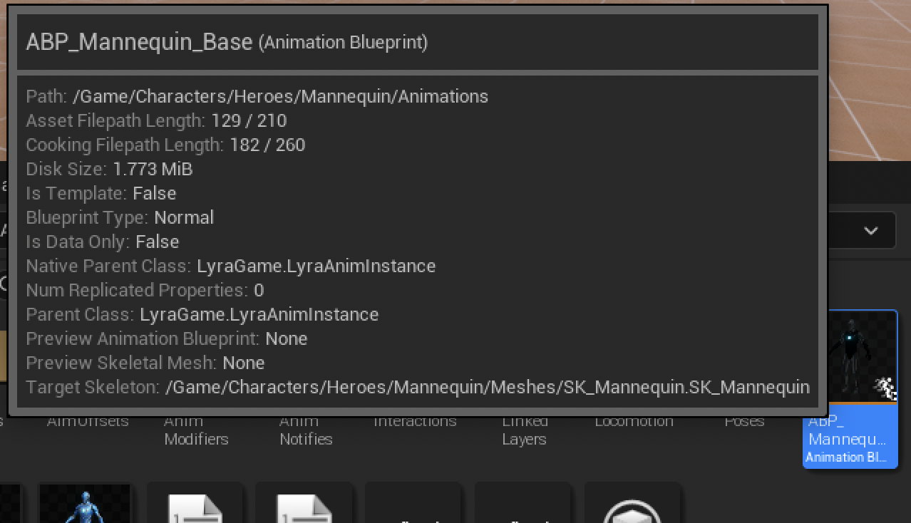





> This is a series of notes about what I've learned from Epic's Lyra project. Which claim to be the best practices under current unreal engine framework. Some I don't know about, some I already know but I thought it would still be good noting down.
{: .prompt-info }

## Animation System Structure
Epic has already released an official document about [Animations In Lyra]. The whole structure of animation system in Lyra can be summarized as:
- The `Character BP` referencing the `Animation Blueprint` to drive the character skeleton.
- The `Animation Blueprint` is a framework that only contains the logic and transitions between different animation states. No actual animation assets are referenced here.
- The actual animation assets are being dynamically injected into the Animation Blueprint as an `Animation Linked Layer`. This allows for a modular approach to animation, where different layers can be swapped in and out depending on the character's state or the weapon being used.

In short, there are 4 main counterparts in the animation system:
- `Animation Linked Interface` - A shared protocol for the animation blueprints involved, it defines a common contract, for each `ALI` function, we can input something (Or usually nothing), and return out an animation pose
- `Animation Blueprint` - The main logic that determines what state should we be in, and get one interface function from the `ALI` to presume that the animation needed here will be injected some time in the future. This class constructed a logic framework and connects animations with a virtual hook point. It only cares about what arbitrary animation should be played at what time, without caring about the actual animation assets.
- `Animation Linked Layer Base` - The base class that actually implements each `ALI` interface, but still doesn't contain any animation assets, instead, all animation assets are variables. This class constructed a data binding flow, that binds the virtual hook point, to virtual animation assets. It only cares about what animation assets should be used per interface function, without caring about who would use it.
- `Animation Linked Layer` - The actual animation assets that are being injected into the character used `Animation Blueprint`. Since it inherits from the `Animation Linked Layer Base`, there's no need to implement any further logics, so think of it as a data container. This class provides all the data that the `AnimLLB` needs, hence `AnimLLB` would dynamically output an animation pose for `AnimBP` through `ALI`, eventually feed back to the `AnimBP` and finally output to the skeleton mesh.

Sounds complicated but once you get the hang of it, it's actually quite simple. The benefit of this approach is very obvious, want to add 20 types of weapons without letting an animation blueprint to load all the assets? Not felling like duplicating the same logic over and over again? Hate to debug animation and write error prone logic? Want multiple teammates to work together? Well this is the savior.

## Animation Blueprint
From the reference chain we can see that this part is still the same as UE4, we have character BP, on which we would have some skeleton meshes, and then we references an anim bp as `AnimInstance`. So far so good.

{: width="800"}

Inspecting the asset, the first thing we see is this is not a normal anim instance, but a class derived from `LyraAnimInstance`. We will cover what does it do later.
{: width="600"}

## Animation Blueprint Structure
The class itself seems overwhelming, it kind of is. But let's don't lose our focus here and break it down step by step.

First thing first, an animation blueprint really just does one thing - Tell the controlled skeleton what to do at current frame. For each frame, it's actually just outputting a pose. Which was calculated by a tons of logics, correction, IK, anim swapping, procedural operations, blah blah. Yet it doesn't change it's nature - An `AnimGraph` usually consists of a `locomotion` state machine, then after some pre-processing, some post-processing, some blending and mixing, etc. finally a final pose gets generated.

In order to have all these decisions (when to play what) to be made, we are constantly pulling data from our character, or even from the game itself.

Ultimately, we are trying to decide which pose should we playing now (in `Anim Graph`), based on the data we have (in `Event Graph` and/or `functions`).

To echo with the first section, we have mentioned that this class is merely a framework, it doesn't contain any animation assets. The actual animation assets are being dynamically injected into the character used `Animation Blueprint` as an `Animation Linked Layer`. This allows for a modular approach to animation, where different layers can be swapped in and out depending on the character's state or the weapon being used. In fact, here's the comment left by Epic:

<div class="box-info" markdown="1">
<div class="title"> AnimBP Tour #3</div>
This `Anim Graph` does not reference any animations directly. It instead provides entry points for `Montages` and `Linked Animation Layers` to play poses at certain points in the graph. This graph's main purpose is to blend those entry points together (e.g. blending upper and lower body poses together).
This approach allows us to only load animations when they're needed. For example, a weapon will hold references to the required `Montages` and `Linked Animation Layers`, so that data will only be loaded when the weapon is loaded.
E.g. `B_WeaponInstance_Shotgun` holds references to `Montages` and `Linked Animation Layers`. That data will only be loaded when `B_WeaponInstance_Shotgun` is loaded.
`B_WeaponInstance_Base` is responsible for linking animation layers for weapons.
</div>

If the reader was used to UE4 animation system, be ready, there're quite some differences between the two engine versions. Since Animation system are well known for its CPU thirty nature, in order to leverage multithreading as much as possible, a bunch of practices used in Lyra Animation were coming from this post [Animation Optimization], so it's highly recommended to skim through that over first, otherwise the rest contents might be a bit hard to digest. Anyway, let's begin exploring the anatomy of the `AnimGraph`:

## AnimGraph
`AnimGraph` is the core of the animation blueprint, it defines the flow of the animation data and how it is processed. The `AnimGraph` is divided into several sections, each responsible for a specific part of the animation process.

### Locomotion And Left Hand Override
The first part is `locomotion`, a state machine that handles the basic movement of the character, once we output a pose, it went into `LeftHandPose_OverrideState` and being cached for future usage.

{: width="800"}

The `LeftHandPose_OverrideState` is an `AnimationLinkedInterface`, as mentioned before, it defines a shared protocol for the main animation blueprint and the `linked animation layers`, think of it as a hook, where we can plug in other animation assets, and the main logic will just take whatever is being plugged in. For more information about this, please refer to the official document [Animation Linked Layer]

{: width="800"}

> Notice the `Flash` icon on the node? This is a `Fast Path` node, well explained in the [Animation Optimization]
{: .prompt-info }

In the implementation, we can see that the pose from `locomotion` state machine is being blended with a `left hand pose override` variable, a `SequenceEvaluator(ByTime)` node is wired afterwards, with `ExplicitTime` set to `0`, this means that we will just extract the first frame of that override animation. Then, both pose went through a `LayeredBlendPerBone` node. Which bone? All the left hand fingers.

{: width="600"}

To this point, we kinda know what is actually happening here, some weapons might have a different grip attachments, that when we snap our left hand to the weapon, few fingers might overlapping with the mesh (Like a Vertical Grip, Angled Forward Grip, etc). So we procedurally bend the fingers to match the weapon (attachment) mesh.

{: width="800"}

How much should we blend them? Well here we bind function `SetLeftHandPoseOverrideWeight` to the node, that will be called everytime this node updates. It's not rocket science, basically just read a few variables set from the instance, who did it? Shotgun.

{: width="800"}

{: width="800"}

### Upper/Lower Body Blend
Now that we have the locomotion base part out of the way, next step is to blend the upper and lower body together. The idea behind it is, there would be tons of `montages` gets played, they are exotic, often one shot that comes with gameplay abilities, etc. Problem is, we don't want a montage to hijack our lower body animation, if we are running while shooting, we definitely want to keep running than sliding on the ground because an "Idle Shooting" montage is being played.

This is done by a `LayeredBlendPerBone` node as well, which allows us to blend different animation layers together based on the bone hierarchy. The `LayeredBlendPerBone` node takes in two poses, the upper body pose and the lower body pose, and blends them together based on the bone hierarchy.

{: width="800"}

There're two types of `Montage`, additive and regular. Stuff like shooting are usually `Additive` (Full body additive), our locomotion would modify the whole body already, and upon whatever pose we have, we are just gonna add another shooting motion to it. In Lyra, firing is a `FullBodyAdditivePreAim` slot montage

And the other type is regular, just like fancy dance, it doesn't really care where the player is looking at, as it will take over the skeleton. Emote dancing montage is at slot `FullBody`

Reloading and throwing grenade is a bit special, the montage have both `UpperBody` and `UpperBodyAdditive` slots.

#### Additive Blend
With, first we took the cached `Locomotion` pose, and `ApplyAdditive` it with the slot `UpperBodyAdditive`. This is basically saying: "Hey, add whatever `montage` is being played on the upper body to the current locomotion pose". Note we passed an `AdditiveIdentityPose` node in the slot, it just means if we don't have anything to add, output the `locomotion` as it is, An `identity pose` will not change the pose it's adding to.

But how much should they be blended, well, it's controlled by the `UpperbodyDynamicAdditiveWeight` variable, and here's the update logic:

{: width="800"}

Basically, when we are playing any `Montage` on ground, the `Montage` would just be fully applied, otherwise, if we are jumping in air, then we will have a nice transition over to `locomotion` pose.

#### Regular Blend
For dancing animation, they are not additive, so we would just use a `Slot` node for `Montages`

As mentioned before, reloading has both `UpperBody` and `UpperBodyAdditive` slots


The `UpperBody` slot is used to play the reloading animation, while the `UpperBodyAdditive` slot is used to play the additive animation. However, if we look at the `LayeredBlendPerBone` node, we can see that the blend weight for the `UpperBody` slot is set to `1`, so technically, the `UpperBodyAdditive` slot is not being used at all？Then what's the whole point of having them there? The answer is, the blend weight here does not mean that every bone is using `blend pose 0`, because we also have a thing called `Blend Profile`, which is a profile that defines how the blend weight is applied to each bone in the hierarchy. This allows us to have different blend weights for different bones, so we can have more control over how the animation is blended.

#### Blend Profile
As can be seen from the image, there's a nice transition from `Spine1` all the way up to the `Arm` bones, the weight gradually climbs up to `1`, so for those bones that doesn't have full weights, they will still blend with the `Additive` pose.

{: width="800"}

#### FullBodyAdditivePreAim
We have split `UpperBody` slot out, blend back with `Locomotion` pose, then Lyra sent everything to another slot `FullBodyAdditivePreAim`. This is for all the firing animations, as well as weapon recoil, etc. This is done by having an `AnimNotify` along with the firing animation, and players another `Montage` on top of the `FullBodyAdditivePreAim` slot.


#### Caching UpperBodyLowerBodySplit
Finally, this gets cached to `UpperBodyLowerBodySplit` node.

Although we did mentioned firing, but from the above image we know that this part is mostly dealing with `Grenade` and `Reloading`, as these are the only montages using `UpperBody` related slots.

### Aiming, Fullbody Additive and Fullbody Montage
Only a few things left! Now we need to deal with `Aiming`. It's quite easy to realize that `Aiming` is going to be different for different weapons (Imaging aiming a Desert Eagle like a sniper rifle, we've just created some goofy concepts...) Anything bind to specific type of weapon should go to `AnimLinkedLayer`, and this is exactly what happens here - an `ALI` hook.

Next we have `Fullbody Additive`, which is another `LinkedLayer`, this is for jump recovery animations, like holding a pistol would have different jump recovery animation than holding a shotgun.


{: width="800"}

Finally we have `FullBody` Montage slot. That's for the dashing ability, where the player can dash to any direction.

### Inertialization and Turn In Place
Almost there! Next we have `Inertialization`, a per bone blend node to smooth two different poses transition, it's a common practice to use after processed all the animation data, so here we put it at the end of the graph (sort of).

Turn in place is another common practice to solve foot sliding. Here's the comment left by Epic:

<div class="box-info" markdown="1">
<div class="title"> TurnInPlace #1 (also see ABP_ItemAnimLayersBase)</div>
When the Pawn owner rotates, the mesh component rotates with it, which causes the feet to slide.
Here we counter the character's rotation to keep the feet planted.
</div>


### Procedural Fixup - Hand Leg and Foot
Same old, we are calling an `AnimLinkedLayer` to deal with per weapon IK fixup for hand, because different weapons might have different IK alpha for hands. We also need to place our foot on the ground, so two parts here:

#### DisableHandIKRetargeting
First part is `DisableHandIKRetargeting`, it's a curve that allow temporary disable both hand IKs, although I didn't find any montage using this, it could be useful to override the hand IK at a global level.

#### DisableLHandIK and DisableRHandIK
The second part is `DisableLHandIK`, and `DisableRHandIK`, these are usually used for equipment and unequipment animations. It can also be used in pistol melee animation, where the character would just smash the enemy with one hand holding the gun.

{: width="800"}

These values will be read from the curve, and then get's updated to `HandIKLeftAlpha` and `HandIKRightAlpha` variables. Eventually drive each side IK with `TwoBoneIK` node.

{: width="600"}

#### Foot Placement & DisableLegIK
Next we need to resolve the foot placement, this is done by a `FootPlacement` node. This node will take in the current foot position and the ground normal, and then calculate the new foot position based on the ground normal. This is useful for when the character is walking on uneven terrain, as it will ensure that the feet are always planted on the ground.

Then, we have `DisableLegIK`, this is a curve that used in the dash animations, where the player will dashing in air, hence we don't want to apply any leg IKs.

{: width="600"}

#### Scaling Down Weapon
The final piece is `ScalingDownWeapon`, this is a curve that used in the equipment animation, where when the player unholstered the weapon, it's actually being scaling down to 0. I would doubt if this is a best practice, but it does the work so...

{: width="800"}

#### Procedural Fixup - Knee
We calls into control rig to mainly fix the knee from intersecting with the torso when we are crouching at a slope. Aaaaand done! This is a sneak peak of the mere "Animation Framework" (I know, AAA game has an insane amount of complexity)

{: width="800"}

## Locomotion State Machine
Now let's step inside the `Locomotion` state machine, Epic left a comment here:

<div class="box-info" markdown="1">
<div class="title"> AnimBP Tour #4</div>
This state machine handles the transitions between high level character states.
The behavior of each state is mostly handled by the layers in `ABP_ItemAnimLayersBase`.
</div>

We will skip on what and how to use it, because it's pretty much the same as UE4, an official document is available here [Animation State Machine]

In general, the state machine authors two parts, movement and jumping.

### Movement
Upon entry, we start in `Idle` state:

{: width="800"}

#### Idle State
Feed `ALI_ItemAnimLayers - FullBody_IdleState` while calls `UpdateIdleState` on updating state

{: width="800"}

#### Idle -> Start
- `Idle`
    - Enter `Start` state
        - If `HasAcceleration` OR `(GameplayTag_IsMelee AND HasVelocity)`

`Idle` will transit to `Start` state if we have acceleration or if we are meleeing and has velocity.

#### Start State
Applies `BS_MM_Rifle_Jog_Leans` with `AdditiveLeanAngle` as addtive pose to `ALI_ItemAnimLayers - FullBody_StartState`, calls `SetUpStartState` on `BecomeRelevant` and `UpdateStartState` on updating state.

The `BecomeRelevant` can be considered as a `OnBeginPlay`, there's also a `OnInitialUpdate` which can be considered as `OnPreBeginPlay`.

We applied a `Lean` animation, so that the character will lean to one side to achieve a realistic look.

{: width="800"}

#### Start -> Cycle/Stop
- `Start`
    - Enter `Cycle` state
        - If `Abs(RootYawOffset)` > 60 (Priority 1)
        - Or `LinkedLayerChanged` (Priority 1)
        - Or `AutomaticRule` (Priority 2)
        - Or `(StartDirection != LocalVelocityDirection)` OR `CrouchStateChange` OR `ADSStateChanged` OR `(CurrentStateTime(LocomotionSM) > 0.15 AND DisplacementSpeed < 10.0)`
    - Enter `Stop` state (Priority 3)
        - If !(`HasAcceleration` OR `(GameplayTag_IsMelee AND HasVelocity)`)

`Start` can transit to `Cycle` or `Stop` state, notice that we have different priorities here, for each transition condition, we can have granular control over how the transition should be made, for example, change the transition duration or blend logic.

The `AutomaticeRule` ensures that we won't stuck in the `Start` state indefinitely, there's always a place to go.

We also noticed some transitions are dark red, this means they share the same conditions, this is a way to create sharable conditions for better maintainability.

#### Cycle State
Applies `BS_MM_Rifle_Jog_Leans` with `AdditiveLeanAngle` as addtive pose to `ALI_ItemAnimLayers - FullBody_CycleState`, so the leaning effect can be preserved across the whole locomotion state.

{: width="800"}

#### Cycle -> Stop
- `Cycle`
    - Enter `Stop` state
        - If !(`HasAcceleration` OR `(GameplayTag_IsMelee AND HasVelocity)`)

Nothing fancy here, reused the shared condition from `Start` to `Stop`.

#### Stop State
Feed `ALI_ItemAnimLayers - FullBody_StopState` while calls `UpdateStopState` on updating state

{: width="800"}

#### Stop -> Start/Idle
- `Stop`
    - Enter `Start` state
        - If `HasAcceleration`
    - Enter `Idle` state
        - Or `LinkedLayerChanged` (Priority 1)
        - Or `CrouchStateChange` OR `ADSStateChanged` (Priority 2)
        - Or `AutomaticRule` (Priority 3)

Same as before, the `AutomaticeRule` is here to ensure we won't stuck in the stop state. So far, we have modeled the basic locomotion in a structure if Idle -> Start -> Cycle -> Stop -> Idle, easy to understand.

#### PivotSources -> Pivot
- `PivotSources`
    - Enter `Pivot` state
        - If ((`LocalVelocity2D` dot `LocalAcceleration2D`) < 0.0) AND !`IsRunningIntoWall`

The `PivotSources` is a `State Alias`, it is just a representation of the `Start` and `Cycle` state.

{: width="600"}

This is used to blend a drastic change in direction (Opposite direction).

Just a side note here, the way the editor dynamically querys all the user created states and showing it in details panel is not a common variable, but a customized editor slate.

```cpp
void FAnimStateAliasNodeDetails::GenerateStatePickerDetails(UAnimStateAliasNode& AliasNode, IDetailLayoutBuilder& DetailBuilder)
{
    ReferenceableStates.Reset();
    GetReferenceableStates(AliasNode, ReferenceableStates);

    if (ReferenceableStates.Num() > 0)
    {
        IDetailCategoryBuilder& CategoryBuilder = DetailBuilder.EditCategory(FName(TEXT("State Alias")));
        CategoryBuilder.AddProperty(GET_MEMBER_NAME_CHECKED(UAnimStateAliasNode, bGlobalAlias));

        FDetailWidgetRow& HeaderWidgetRow = CategoryBuilder.AddCustomRow(LOCTEXT("SelectAll", "Select All"));

        HeaderWidgetRow.NameContent()
            [
                SNew(STextBlock)
                .Text(LOCTEXT("StateName", "Name"))
                .Font(IDetailLayoutBuilder::GetDetailFontBold())
            ];

        HeaderWidgetRow.ValueContent()
            [
                SNew(SHorizontalBox)
                + SHorizontalBox::Slot()
                .AutoWidth()
                .VAlign(VAlign_Center)
                [
                    SNew(STextBlock)
                    .Text(LOCTEXT("SelectAllStatesPropertyValue", "Select All"))
                    .Font(IDetailLayoutBuilder::GetDetailFontBold())
                ]
                + SHorizontalBox::Slot()
                .FillWidth(1.0f)
                .HAlign(HAlign_Right)
                .VAlign(VAlign_Center)
                [
                    SNew(SCheckBox)
                    .IsChecked(this, &FAnimStateAliasNodeDetails::AreAllStatesAliased)
                    .OnCheckStateChanged(this, &FAnimStateAliasNodeDetails::OnPropertyAliasAllStatesCheckboxChanged)
                    .IsEnabled_Lambda([this]() -> bool 
                        {
                            return !IsGlobalAlias();
                        })
                ]
            ];

        for (auto StateIt = ReferenceableStates.CreateConstIterator(); StateIt; ++StateIt)
        {
            const TWeakObjectPtr<UAnimStateNodeBase>& StateNodeWeak = *StateIt;
            if (const UAnimStateNodeBase* StateNode = StateNodeWeak.Get())
            {
                FString StateName = StateNode->GetStateName();
                FText StateText = FText::FromString(StateName);

                FDetailWidgetRow& PropertyWidgetRow = CategoryBuilder.AddCustomRow(StateText);

                PropertyWidgetRow.NameContent()
                    [
                        SNew(STextBlock)
                        .Text(StateText)
                        .ToolTipText(StateText)
                        .Font(IDetailLayoutBuilder::GetDetailFont())
                    ];

                PropertyWidgetRow.ValueContent()
                    [
                        SNew(SHorizontalBox)
                        + SHorizontalBox::Slot()
                        .FillWidth(1.0f)
                        .HAlign(HAlign_Right)
                        .VAlign(VAlign_Center)
                        [
                            SNew(SCheckBox)
                            .IsChecked(this, &FAnimStateAliasNodeDetails::IsStateAliased, StateNodeWeak)
                            .OnCheckStateChanged(this, &FAnimStateAliasNodeDetails::OnPropertyIsStateAliasedCheckboxChanged, StateNodeWeak)
                            .IsEnabled_Lambda([this]() -> bool 
                                {
                                return !IsGlobalAlias();
                                })
                        ]
                    ];
            }
        }
    }
}
```

#### Pivot State
Applies `BS_MM_Rifle_Jog_Leans` with `AdditiveLeanAngle` as addtive pose to `ALI_ItemAnimLayers - FullBody_PivotState`, calls `SetUpPivotState` on `BecomeRelevant` and `UpdatePivotState` on updating state.

{: width="600"}

#### Pivot -> Cycle/Stop
- `Pivot`
    - Enter `Cycle` state
        - If `LinkedLayerChanged` (Priority 1)
        - Or `WasAnimNotifyStateActiveInSourceState(TransitionToLocomotion)` (Priority 2)
        - Or `CrouchStateChange` OR `ADSStateChanged` OR (`IsMovingPerpendicularToInitialPivor` AND (`LastPivotTime <= 0.0`)) (Priority 3)
    - Enter `Stop` state
        - If !`HasAcceleration`

So basically, if we are doing a drastic change in opposite direction, we will enter `Pivot` state, and if we stopped immediately, it immediately stops and drops the fancy transition otherwise we will feel the control clunky. Or if we changed the moving direction to a perpendicular direction, we will enter `Cycle` state. The transition only being kept if we continue moving in the opposite direction.

### Jumping
The second part is `Jumping`, which models the jumping and falling by a time based state machine. `JumpStart` -> `JumpStartLoop` -> `JumpApex` -> `FallLoop` -> `FallLand` -> `EndInAir`.

{: width="800"}

#### Jump Sources
A `StateAlias` of all states in `Movement` part, meaning any states can enter the jump state.

{: width="600"}

#### JumpSources -> JumpSelector
- `JumpSources`
    - Enter `JumpSelector` state
        - If `True`

Right, this means it's always transitioning to `JumpSelector`, why this is allowed? See below:

#### JumpSelector Conduit
`JumpSelector` is not a state but a conduit, which means it doesn't have any animation associated with it. It is used to control the flow of the state machine and can be used to transition between different states.

#### JumpSelector -> JumpStart/JumpApex
The actual logic of switching to Jump States lands in here

- `JumpSelector`
    - Enter `JumpStart` state
        - If `IsJumping`
    - Enter `JumpApex` state
        - If `IsFalling`

Easy to understand, if we pressed a jump key, we will enter `JumpStart` and follow a parabola curve (We will reach apex height later), but if we accidentally fall off a cliff, then we will enter `JumpApex` state directly because we are already at our apex height.

#### Jump Start State
Feed `ALI_ItemAnimLayers - FullBody_JumpStartState` directly into output pose.

{: width="800"}

#### JumpStart -> JumpStartLoop
- `JumpStart`
    - Enter `JumpStartLoop` state
        - `AutomaticRule`

When the short jump start animation finishes, we push the state to `JumpStartLoop`, and the `AutomaticRule` is here to ensure we won't stuck in the `JumpStart` state.

#### Jump Start Loop State
Feed `ALI_ItemAnimLayers - FullBody_JumpStartLoopState` directly into output pose.

{: width="800"}

#### JumpStartLoop -> JumpApex
- `JumpStartLoop`
    - Enter `JumpApex` state
        - If `TimeToJumpApex` < 0.4

The `TimeToJumpApex` is calculated in `UpdateJumpFallData`, if we are currently jumping, it will be `-WorldVelocity.Z / GravityZ` if we are not jumping, the value will be `0.0`, this is a clever way to extract the data. Because as we grapdually reach the apex, our velocity will decrease to `0`. While `GravityZ` is a constant value.

#### Jump Apex State
Feed `ALI_ItemAnimLayers - FullBody_JumpApexState` directly into output pose.

{: width="800"}

#### JumpApex -> FallLoop
- `JumpApex`
    - Enter `FallLoop` state
        - `AutomaticRule`

When JumpApex state is done, we will enter `FallLoop` state, and the `AutomaticRule` is here to ensure we won't stuck in the `JumpApex` state.

#### Fall Loop State
Feed `ALI_ItemAnimLayers - FullBody_FallLoopState` directly into output pose.

{: width="800"}

#### FallLoop -> FallLand
- `FallLoop`
    - Enter `FallLand` state
        - If `GroundDistance` < 200.0

When we are about to hit the ground, a new animation will be played to blend out jumping.

#### Fall Land State
Feed `ALI_ItemAnimLayers - FullBody_FallLandState` directly into output pose.

{: width="800"}

#### FallLand -> EndInAir
- `FallLand`
    - Enter `EndInAir` conduit
        - If `IsOnGround`

When we are done with the landing animation, we will enter `EndInAir` conduitgv`

#### Jump Fall Interrupt Sources
This is a `StateAlias` of all states in `Jumping` part, meaning any states can enter the jump state.

{: width="600"}

#### JumpFallInterruptSources -> EndInAir
- `JumpFallInterruptSources`
    - Enter `EndInAir` conduit
        - If `IsOnGround`

At anytime, as long as we are in the jumping state, if something weird happens and directly put us on the ground, we will just ignore all other states and directly land here at `EndInAir` conduit.

#### EndInAir Conduit
Another conduit, nothing new here.

#### EndInAir -> CycleAlias/IdleAlias
- `EndInAir`
    - Enter `CycleAlias` state
        - If `HasAcceleration` (Priority 1)
    - Enter `IdleAlias` state
        - `True` (Priority 2)

After we `EndInAir`, if we are still moving, we will enter `CycleAlias` state, otherwise we will enter `IdleAlias` state.

{: width="600"}

{: width="600"}

## BlueprintThreadsafeUpdateAnimation
Now we have finished the whole `Locomotion State Machine`, which is reading and updating tons of variables, some related to the game, some related to the character. But where did these variables come from? If we look at the `UE4` way, usually these gets updated in the `Event Graph`, but here in Lyra if we open the `Event Graph`, we will see the following two comments:

<div class="box-info" markdown="1">
<div class="title"> AnimBP Tour #1  (also see `ABP_ItemAnimLayersBase`) </div>
This `AnimBP` does not run any logic in its Event Graph.
Logic in the Event Graph is processed on the Game Thread. Every tick, the Event Graph for each `AnimBP` must be run one after the other in sequence, which can be a performance bottleneck.
For this project, we've instead used the new `BlueprintThreadsafeUpdateAnimation` function (found in the My Blueprint tab). Logic in `BlueprintThreadsafeUpdateAnimation` can be run in parallel for multiple `AnimBP`'s simultaneously, removing the overhead on the Game Thread.
</div>

That's right, nothing is running in the `Event Graph` because it's not optimized for performance. Instead, we are using `BlueprintThreadsafeUpdateAnimation` function, which is a new function that allows us to run logic in parallel for multiple `AnimBP`s simultaneously. This removes the overhead on the Game Thread and allows us to run logic in a more efficient way. Open the `BlueprintThreadsafeUpdateAnimation` function, and we will see the following comment:

<div class="box-info" markdown="1">
<div class="title"> AnimBP Tour #2</div>
This function is primarily responsible for gathering game data and processing it into useful information for selecting and driving animations.
A caveat with Threadsafe functions is that we can't directly access data from game objects like we can in the Event Graph. This is because other threads could be running at the same time and they could be changing that data. Instead, we use the Property Access system to access data. The Property Access system will copy the data automatically when it's safe.
Here's an example where we access the Pawn owner's location (search for "Property Access" from the context menu).
</div>

All the functions are quite straightforward, so we won't go too deep into them, here's a brief overview of what's going on:
- `UpdateLocationData`
    - Update the current location of the character, as well as the d`elta displacement`.
- `UpdateRotationData`
    - Update the current rotation, as well as the `delta yaw`, this `delta yaw` is then divided by `delta seconds` to get the `delta yaw changing speed`, which is used to calculate the `AdditiveLeanAngle`
- `UpdateVelocityData`
    - Updates `WorldVelocity`, `LocalVelocity`, `LocalVelocity2D`, `LocalVelocityDirectionAngle`, `LocalVelocityDirectionAngleWithOffset` (against `RootYawOffset`)
    - Also updates the Cardinal Representation (Left, Right, Forward, Backward) of the velocity, both with and without `RootYawOffset`
- `UpdateAccelerationData`
    - Updates `WorldAcceleration`, `LocalAcceleration`, `PivotDirection2D`, `CardinalDirectionFromAcceleration`
    - This is where the `Pivot` state is mainly concerning, the comment here says "Calculate a cardinal direction from acceleration to be used for pivots. Acceleration communicates player intent better for that purpose than velocity does."
- `UpdateWallDetectionHeuristic`
    - If we are having an acceleration yet we aren't really speeding up, and our velocity direction is a far from where we are trying to go, the we probably has hit a wall.
- `UpdateCharacterStateData`
    - Update states related to `Character`, including `OnGround`, `Crouch`, `ADSState`, `WeaponFirdState`, `IsJumping`, `IsFalling`
- `UpdateBlendWeightData`
    - We have talked about this before, if there's a montage being played and we are on ground, we will update the `UpperbodyDynamicAdditiveWeight` to `1`, otherwise we will gradually interpolat it to `0.0`
- `UpdateRootYawOffset`
    - The whole function is just trying to update `RootYawOffset` under different scenarios.
    - Comment in this function says "This function handles updating the yaw offset depending on the current state of the Pawn owner."
        - Case 1: 
            - "When the feet aren't moving (e.g. during Idle), offset the root in the opposite direction to the Pawn owner's rotation to keep the mesh from rotating with the Pawn."
        - Case 2:
            - "When in motion, smoothly blend out the offset."
        - Case 3:
            - "Reset to blending out the yaw offset. Each update, a state needs to request to accumulate or hold the offset. Otherwise, the offset will blend out. This is primarily because the majority of states want the offset to blend out, so this saves on having to tag each state."
    - `RootYawOffsetMode` has three options: `Hold`, `Accumulate`, and `BlendOut`. `Hold` means we won't do anything to the `RootYawOffset`, `Accumulate` means we will keep adding to the `RootYawOffset` while our torso rotates to a capped angle, and `BlendOut` means we will gradually reduce the `RootYawOffset` to `0`.
- `UpdateAimingData`
    - Update `AimPitch`, which is just a normalized value of `BaseAimRotation.Pitch`
- `UpdateJumpFallData`
  - Update `TimeToJumpApex`, we have talked about this before, so skipping it.

### Turn In Place
When we update the `RootYawOffset`, eventually we will call `SetRootYawOffset` to update the `RootYawOffset` variable. There are a few notes left by Epic:

<div class="box-info" markdown="1">
<div class="title"> TurnInPlace #3</div>
We clamp the offset because at large offsets the character has to aim too far backwards, which over twists the spine. The turn in place animations will usually keep up with the offset, but this clamp will cause the feet to slide if the user rotates the camera too quickly.
If desired, this clamp could be replaced by having aim animations that can go up to 180 degrees or by triggering turn in place animations more aggressively.
</div>

<div class="box-info" markdown="1">
<div class="title"> TurnInPlace #4</div>
We want aiming to counter the yaw offset to keep the weapon aiming in line with the camera.
</div>

After the yaw offset is too large, a correction animation will be played to reset the direction. In which there's also a curve called `TurnYawAnimationModifier`, Epic commented:

<div class="box-info" markdown="1">
<div class="title"> TurnInPlace #5</div>
When the yaw offset gets too big, we trigger `TurnInPlace` animations to rotate the character back. E.g. if the camera is rotated 90 degrees to the right, it will be facing the character's right shoulder. If we play an animation that rotates the character 90 degrees to the left, the character will once again be facing away from the camera.
We use the "`TurnYawAnimModifier`" animation modifier to generate the necessary curves on each `TurnInPlace` animation.
See `ABP_ItemAnimLayersBase` for examples of triggering `TurnInPlace` animations.
</div>

## ULyraAnimInstance
To this point, we have covered almost everything in this `AnimBP`, just to echo with one last thing that we've mentioned at the beginning, the `AnimBP` is not a normal `Animation Instance` subclass, but inherited from `ULyraAnimInstance`.

Just from the header file, we can see a few things:
- A `IsDataValid` function is being overridden. This is a function that is called by the editor to validate the data in the asset. This is useful for ensuring that the asset is set up correctly and that all required data is present.
- Normal `NativeInitializeAnimation` and `NativeUpdateAnimation` functions are overridden. These are the standard functions that are called when the animation is initialized and updated.
- A `InitializeWithAbilitySystem` function is defined. We will go through it later
- `GameplayTagPropertyMap` and `GroundDistance` are defined as properties. The `GameplayTagPropertyMap` is a map of gameplay tags to blueprint variables, which allows for easy access to gameplay tags in blueprints. The `GroundDistance` property is used to store the distance from the character to the ground.

```cpp
UCLASS(Config = Game)
class ULyraAnimInstance : public UAnimInstance
{
    GENERATED_BODY()

public:

    ULyraAnimInstance(const FObjectInitializer& ObjectInitializer);

    virtual void InitializeWithAbilitySystem(UAbilitySystemComponent* ASC);

protected:

#if WITH_EDITOR
    virtual EDataValidationResult IsDataValid(class FDataValidationContext& Context) const override;
#endif // WITH_EDITOR

    virtual void NativeInitializeAnimation() override;
    virtual void NativeUpdateAnimation(float DeltaSeconds) override;

protected:

    // Gameplay tags that can be mapped to blueprint variables. The variables will automatically update as the tags are added or removed.
    // These should be used instead of manually querying for the gameplay tags.
    UPROPERTY(EditDefaultsOnly, Category = "GameplayTags")
    FGameplayTagBlueprintPropertyMap GameplayTagPropertyMap;

    UPROPERTY(BlueprintReadOnly, Category = "Character State Data")
    float GroundDistance = -1.0f;
};
```

### GameplayTagPropertyMap
To understand what this class does, let's take a look at the implementation: The starting logic is quite simple, during initialization, we get `ASC` from the owning actor and call `InitializeWithAbilitySystem` to initialize the `GameplayTagPropertyMap`. This will form a mapping between `FGameplayTag` and a `FProperty`, one actual property on this class. And everytime when the tags has been changed with a new value, it will be set to the corresponding property as well. Pretty much the same like we write a `OnTagChanged` callback, and then set data to a property.

```cpp
void ULyraAnimInstance::NativeInitializeAnimation()
{
    Super::NativeInitializeAnimation();

    if (AActor* OwningActor = GetOwningActor())
    {
        if (UAbilitySystemComponent* ASC = UAbilitySystemGlobals::GetAbilitySystemComponentFromActor(OwningActor))
        {
            InitializeWithAbilitySystem(ASC);
        }
    }
}

// ...

void ULyraAnimInstance::InitializeWithAbilitySystem(UAbilitySystemComponent* ASC)
{
    check(ASC);

    GameplayTagPropertyMap.Initialize(this, ASC);
}
```

{: width="800"}

What really makes me interested is the `PropertyToEdit` here, how do we get a drop down of a dynamically created blueprint property? The answer is in the `FGameplayTagBlueprintPropertyMapping` struct:

- `TFieldPath<FProperty>` is a type of property that allows us to reference a property on a class by its name

```cpp
/**
 * Struct used to update a blueprint property with a gameplay tag count.
 * The property is automatically updated as the gameplay tag count changes.
 * It only supports boolean, integer, and float properties.
 */
USTRUCT()
struct GAMEPLAYABILITIES_API FGameplayTagBlueprintPropertyMapping
{
    GENERATED_BODY()

public:
    // ...
    /** Property to update with the gameplay tag count. */
    UPROPERTY(VisibleAnywhere, Category = GameplayTagBlueprintProperty)
    TFieldPath<FProperty> PropertyToEdit;
    // ...
};
```

"By it's name?!" I hear you scream. Yes, I know what you're thinking. A simple rename of the property will break the mapping here. Although it's not a very big problem, because even we are using some sort of reference to the property, we can still delete it and cause a null reference here. What's really important is that the user could be propertly notified about this error. And that's where validation would kick in.

Everytime the blueprint saves or we manually called validation on the data. The `IsDataValid` function will be called. This is where we can check if the property is valid or not. If it's not, we can return an error message to the user.

```cpp
#if WITH_EDITOR
EDataValidationResult ULyraAnimInstance::IsDataValid(FDataValidationContext& Context) const
{
    Super::IsDataValid(Context);

    GameplayTagPropertyMap.IsDataValid(this, Context);

    return ((Context.GetNumErrors() > 0) ? EDataValidationResult::Invalid : EDataValidationResult::Valid);
}
#endif // WITH_EDITOR
```

With `IsDataValid` we are essentially calling the underlying `IsDataValid` function on the `FGameplayTagBlueprintPropertyMapping` struct. This will check if all the properties are valid. It will fail to compile, and an error will be logged.

{: width="800"}

{: width="800"}

### GroundDistance
Only one thing left for this class, the `GroundDistance` property. This is a simple float value that stores the distance from the character to the ground. This is used to determine if the character is on the ground or not so we can transition from jump to land state. The value is updated every frame in `NativeUpdateAnimation`.

```cpp
void ULyraAnimInstance::NativeUpdateAnimation(float DeltaSeconds)
{
    Super::NativeUpdateAnimation(DeltaSeconds);

    const ALyraCharacter* Character = Cast<ALyraCharacter>(GetOwningActor());
    if (!Character)
    {
        return;
    }

    ULyraCharacterMovementComponent* CharMoveComp = CastChecked<ULyraCharacterMovementComponent>(Character->GetCharacterMovement());
    const FLyraCharacterGroundInfo& GroundInfo = CharMoveComp->GetGroundInfo();
    GroundDistance = GroundInfo.GroundDistance;
}
```

## ABP_ItemAnimLayersBase
We are not done yet! Way to go! (Just kidding, feel free to go asleep and come back later, I know this is an exhausting trip :D)

This section can be started with the following introduction by Epic:

<div class="box-info" markdown="1">
<div class="title"> AnimBP Tour #6</div>
This `animbp` was authored to handle the logic for common weapon types, like `Rifles` and `Pistols`. If custom logic is needed (e.g. for a weapon like a `bow`), a different animbp could be authored that implements the `ALI_ItemAnimLayers` interface.
Rather than referencing animation assets directly, this animbp has a set of variables that can be overridden by `Child Animation Blueprints`. These variables can be found in the "`Anim Set - X`" categories in the `My Blueprint` tab.
This allows us to reuse the same logic for multiple weapons without referencing (and thus loading) the animation content for each weapon in one animbp.
See `ABP_RifleAnimLayers` for an example of a `Child Animation Blueprint` that provides values for each "`Anim Set`" variable.
</div>

A fancy feature is the `ABP_ItemAnimLayersBase`, despite not inherit from `ULyraAnimInstance`, it implements a method to access properties from the `ABP_Mannequin_Base` class. So the properties are effectively shared between the two classes.

### Item Anim Layers
With previous knowledge, it should be easier to understand. Let's first examine these `ALI` interfaces.

#### LeftHandPose_OverrideState
We have discussed this before, the first pose of left hand override state is being blended to the input pose. The animation asset is a variable `LeftHandPoseOverride`.

{: width="800"}

#### FullBody_SkeletalControls
Also discussed in the IK Fixup section already.

#### FullBodyAdditives
Three states SM, yet there's nothing in the `Identity` and `AirIdentity` state, as the name indicated, they represent "Nothing" (A.K.A identity pose), add them to anything wwon't change that original pose.

{: width="800"}

The whole purpose of having this state here is to player the jump landing recovery animation.

{: width="800"}

#### FullBody_IdleState
This state machine authors the logic for standing still and turn in place.

<div class="box-info" markdown="1">
<div class="title"> AnimBP Tour #7</div>
This animbp implements a layer for each state in AnimBP_Mannequin_Base.
Layers can play a single animation, or contain complex logic like state machines.
</div>

{: width="800"}

- `Idle`
    - Enter `IdleBreak` State
        - If `TimeUntilIdleBreak` < 0.0
    - Enter `TurnInPlace` State
        - If `Abs(RootYawOffset)` > 50.0 (Shared)

{: width="800"}

Inside the `Idle Sub SM`, we can see that it's just switching the crouch and uncrouch state.

- `IdleBreak`
    - Enter `Idle` State
        - If !`GameplayTag_IsFiring` (Priority 1)
        - Or !`CanPlayIdleBreak` (Priority 2)
        - Or `AutomaticRule` (Priority 2)
    - Enter `TurnInPlace` State
        - If `Abs(RootYawOffset)` > 50.0 (Shared)

{: width="800"}

`Idle Break` animations are played when the character is idle for a certain amount of time. The `TimeUntilIdleBreak` variable is used to determine when to play the animation. If the character is not firing and the `CanPlayIdleBreak` variable is true, the animation will be played. The `AutomaticRule` is used to ensure that the animation will be played if the other conditions are not met.

The interesting part here is the Sequence Player aren't referencing animation directly, instead, it's calling the `SetUpIdleBreakAnim` function when `OnBecomeRelevant`, which references an `IdleBreak` array of assets

{: width="800"}

- `TurnInPlace`
    - Enter `TurnInPlaceRevovery` State
        - If `GetCurveValue(TurnYawWeight)` == 0.0

Similarly, we call the `SetUpTurnInPlaceAnim` to set the animation asset variable. During update, it will auto select a correct turn in place animation based on the `Direction` variable.

{: width="800"}

- `TurnInPlaceRecovery`
    - Enter `Idle` State
        - `AutomaticRule`
    - Enter `TurnInPlace` State
        - If `Abs(RootYawOffset)` > 50.0 (Shared)

{: width="800"}

Epic also explained the design intention behind this part in the comment:

<div class="box-info" markdown="1">
<div class="title"> TurnInPlace #6 (also see AnimBP_Mannequin_Base)</div>
When the yaw offset gets big enough, we trigger a TurnInPlace animation to reduce the offset.
TurnInPlace animations often end with some settling motion when the rotation is finished. During this time, we move to the TurnInPlaceRecovery state, which can transition back to the TurnInPlaceRotation state if the offset gets big again.
This way we can keep playing the rotation part of the TurnInPlace animations if the Pawn owner keeps rotating, without waiting for the settle to finish.
</div>

#### FullBody_StartState
In this state, Epic left two comments:

<div class="box-info" markdown="1">
<div class="title"> AnimBP Tour #8</div>
This is an example use case of Anim Node Functions.
Anim Node Functions can be run on animation nodes. They will only run when the node is active, which allows us to localize logic to specific nodes or states.
In this case, an Anim Node Function selects an animation to play when the node become relevant. Another Anim Node Function manages the play rate of the animation.
</div>

At this point we've already seen this `Anim Node Functions` for a million times. So it's no longer a mystery to us.

{: width="800"}

Next we have two distance matching functions, one is `DistanceMatching`, the other is `StrideWarper`. The first one is used to match the distance traveled by the animation to the distance traveled by the Pawn owner. The second one is used to warp the animation to match the speed of the Pawn owner.

<div class="box-info" markdown="1">
<div class="title"> AnimBP Tour #9</div>
This is an example of using Distance Matching to ensure that the distance traveled by the Start animation matches the distance traveled by the Pawn owner. This prevents foot sliding by keeping the animation and the motion model in sync.
This effectively controls the play rate of the Start animation. We clamp the effective play rate to prevent the animation from playing too slowly or too quickly.
If the effective play rate is clamped, we will still see some sliding. To fix this, we use Stride Warping later to adjust the pose to correct for the remaining difference.
The Animation Locomotion Library plugin is required to have access to Distance Matching functions.
</div>

Luckily, Epic has wrapped these two giant functions into a single node - `Orientation Warping` and `Stride Warping`.

{: width="800"}

{: width="800"}

<div class="box-info" markdown="1">
<div class="title"> AnimBP Tour #10</div>
This is an example of warping the authored pose of the animation to match what the Pawn owner is actually doing.
Orientation Warping will rotate the lower body of the pose to align to the direction the Pawn owner is moving. We only author Forward/Back/Left/Right directions and rely on warping to fill in the gaps.
Orientation Warping will then realign the upper body so that the character continues to aim where the camera is looking.
Stride Warping will shorten or lengthen the stride of the legs when the authored speed of the animation doesn't match the actual speed of the Pawn owner.
The Animation Warping plugin is required to have access to these nodes.
</div>

#### FullBody_CycleState
In `UE4`, we might just cover the `locomotion` part in a 2d blendspace, but this is not the case in `Lyra`, for this state, aside from the still active `Stride Warping` and `Orientation Warping`, the actual animations are being picked from `UpdateCycleAnim` function based on current `CardinalDirection` we've calculated.

We also called `SetPlayrateToMatchSpeed` here (Very much alike what a blendspace does).


#### FullBody_StopState
Nothing new here, we have covered all knowledges for this state.

{: width="800"}

#### FullBody_PivotState
`PivotState` is controlled by `PivotSM`, similar to `CycleState` a function is being called to select correct pivot change animation.

{: width="800"}

{: width="800"}

#### FullBody_JumpStartState
Feed `JumpStart` animation and blend with `HipFireRaiseWeaponPose` for current weapon

{: width="800"}

#### FullBody_JumpStartLoopState
Feed `JumpStartLoop` animation and blend with `HipFireRaiseWeaponPose` for current weapon

{: width="800"}

#### FullBody_JumpApexState
Feed `JumpApex` animation and blend with `HipFireRaiseWeaponPose` for current weapon

{: width="800"}

#### FullBody_FallLoopState
Feed `JumpFallLoop` animation and blend with `HipFireRaiseWeaponPose` for current weapon

{: width="800"}

#### FullBody_FallLandState
Feed `JumpFallLand` animation and blend with `HipFireRaiseWeaponPose` for current weapon

Also called `UpdateFallLandAnim` per update tick, to do distance matching towards the landing target.

{: width="800"}

#### FullBody_Aiming
The traditional `AnimOffset` method, nothing new here.

{: width="800"}

### Update Animations
That's the anatomy of the `AnimGraph`, now same old, we need to provide and update the data needed.

To update the variables, we are still using `BlueprintThreadsafeUpdateAnimation` while left the `Event Graph` empty. Here're a few comments left by Epic:

<div class="box-info" markdown="1">
<div class="title"> AnimBP Tour #5</div>
As with `AnimBP_Mannequin_Base`, this animbp performs its logic in `BlueprintThreadSafeUpdateAnimation`.
Also, this animbp can access data from `AnimBP_Mannequin_Base` using `Property Access` and the `GetMainAnimBPThreadSafe` function. An example is below.
</div>

The logic here is really not that complex, comparing with the one in `ABP_Mannequin_Base`:
- `UpdateBlendWeightData`
    - Update `UpperbodyDynamicAdditiveWeight` and `AimOffsetBlendWeight`
- `UpdateJumpFallData`
    - Update `TimeFalling` to be the time since the last in air state
- `UpdateSkelControlsData`
    - Based on `DisableLHandIK` and `DisableRHandIK` to update the `HandIKLeftAlpha` and `HandIKRightAlpha`

### Takeaways
Phew, that was tough, but we made it! It's really nice to see how Epic implemented such system, while a lot of these things are pretty common for AAA games, it's way way way more complex than an indie game needs, so if the reader is thinking about using this system in their next solo or 3 persons project. I would recommend just learn the engineering process behind it than actually use it.

[Animation Optimization]: https://dev.epicgames.com/documentation/en-us/unreal-engine/animation-optimization-in-unreal-engine#aniamtionfastpath
[Animations In Lyra]: https://dev.epicgames.com/documentation/en-us/unreal-engine/animation-in-lyra-sample-game-in-unreal-engine?application_version=5.0
[Animation Linked Layer]: https://dev.epicgames.com/documentation/en-us/unreal-engine/animation-blueprint-linking-in-unreal-engine
[Animation State Machine]: https://dev.epicgames.com/documentation/en-us/unreal-engine/state-machines-in-unreal-engine