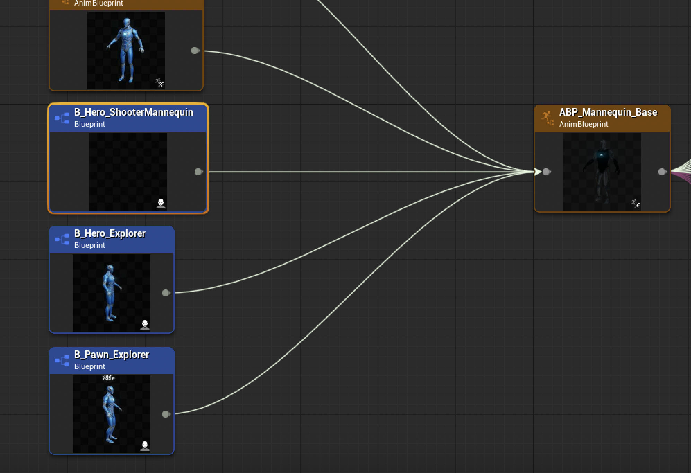





> This is a series of notes about what I've learned from Epic's Lyra project. Which claim to be the best practices under current unreal engine framework. Some I don't know about, some I already know but I thought it would still be good noting down.
{: .prompt-info }

## Animation System Structure
Epic has already released an official document about [Animations In Lyra]. The whole structure of animation system in Lyra can be summarized as:
- The `Character BP` referencing the `Animation Blueprint` to drive the character skeleton.
- The `Animation Blueprint` is a framework that only contains the logic and transitions between different animation states. No actual animation assets are referenced here.
- The actual animation assets are being dynamically injected into the Animation Blueprint as an `Animation Linked Layer`. This allows for a modular approach to animation, where different layers can be swapped in and out depending on the character's state or the weapon being used.

In short, there are 4 main counterparts in the animation system:
- `Animation Linked Interface` - A shared protocol for the animation blueprints involved, it defines a common contract, for each `ALI` function, we can input something (Or usually nothing), and return out an animation pose
- `Animation Blueprint` - The main logic that determines what state should we be in, and get one interface function from the `ALI` to presume that the animation needed here will be injected some time in the future. This class constructed a logic framework and connects animations with a virtual hook point. It only cares about what arbitrary animation should be played at what time, without caring about the actual animation assets.
- `Animation Linked Layer Base` - The base class that actually implements each `ALI` interface, but still doesn't contain any animation assets, instead, all animation assets are variables. This class constructed a data binding flow, that binds the virtual hook point, to virtual animation assets. It only cares about what animation assets should be used per interface function, without caring about who would use it.
- `Animation Linked Layer` - The actual animation assets that are being injected into the `Animation Linked Layer Base`. Since it inherits from the `Animation Linked Layer Base`, there's no need to implement any further logics, so think of it as a data container. This class provides all the data that the `AnimLLB` needs, hence `AnimLLB` would dynamically output an animation pose for `AnimBP` through `ALI`, eventually feed back to the `AnimBP` and finally output to the skeleton mesh.

Sounds complicated but once you get the hang of it, it's actually quite simple. The benefit of this approach is very obvious, want to add 20 types of weapons without letting an animation blueprint to load all the assets? Not felling like duplicating the same logic over and over again? Hate to debug animation and write error prone logic? Want multiple teammates to work together? Well this is the savior.

## Animation Blueprint
From the reference chain we can see that this part is still the same as UE4, we have character BP, on which we would have some skeleton meshes, and then we references an anim bp as `AnimInstance`. So far so good.

{: width="700"}

Inspecting the asset, the first thing we see is this is not a normal anim instance, but a class derived from `LyraAnimInstance`. We will cover what does it do later.
{: width="600"}

## Animation Blueprint Structure
The class itself seems overwhelming, it kind of is. But let's don't lose our focus here and break it down step by step.

First thing first, an animation blueprint really just does one thing - Tell the controlled skeleton what to do at current frame. For each frame, it's actually just outputting a pose. Which was calculated by a tons of logics, correction, IK, anim swapping, procedural operations, blah blah. Yet it doesn't change it's nature - An `AnimGraph` usually consists of a `locomotion` state machine, then after some pre-processing, some post-processing, some blending and mixing, etc. finally a final pose gets generated.

In order to have all these decisions (when to play what) to be made, we are constantly pulling data from our character, or even from the game itself.

Ultimately, we are trying to decide which pose should we playing now (in `Anim Graph`), based on the data we have (in `Event Graph` and/or `functions`).

To echo with the first section, we have mentioned that this class is merely a framework, it doesn't contain any animation assets. The actual animation assets are being dynamically injected into the `Animation Blueprint` as an `Animation Linked Layer`. This allows for a modular approach to animation, where different layers can be swapped in and out depending on the character's state or the weapon being used. In fact, here's the comment left by Epic:

<div class="box-info" markdown="1">
<div class="title"> AnimBP Tour #3</div>
This `Anim Graph` does not reference any animations directly. It instead provides entry points for `Montages` and `Linked Animation Layers` to play poses at certain points in the graph. This graph's main purpose is to blend those entry points together (e.g. blending upper and lower body poses together).
This approach allows us to only load animations when they're needed. For example, a weapon will hold references to the required `Montages` and `Linked Animation Layers`, so that data will only be loaded when the weapon is loaded.
E.g. `B_WeaponInstance_Shotgun` holds references to `Montages` and `Linked Animation Layers`. That data will only be loaded when `B_WeaponInstance_Shotgun` is loaded.
`B_WeaponInstance_Base` is responsible for linking animation layers for weapons.
</div>

If the reader was used to UE4 animation system, be ready, there're quite some differences between the two engine versions. Since Animation system are well known for its CPU thirty nature, in order to leverage multithreading as much as possible, a bunch of practices used in Lyra Animation were coming from this post [Animation Optimization], so it's highly recommended to skim through that over first, otherwise the rest contents might be a bit hard to digest. Anyway, let's begin exploring the anatomy of the `AnimGraph`:

### Locomotion And Left Hand Override
The first part is `locomotion`, a state machine that handles the basic movement of the character, once we output a pose, it went into `LeftHandPose_OverrideState` and being cached for future usage.

{: width="700"}

The `LeftHandPose_OverrideState` is an `AnimationLinkedInterface`, as mentioned before, it defines a shared protocol for the main animation blueprint and the `linked animation layers`, think of it as a hook, where we can plug in other animation assets, and the main logic will just take whatever is being plugged in. For more information about this, please refer to the official document [Animation Linked Layer]

{: width="700"}

> Notice the `Flash` icon on the node? This is a `Fast Path` node, well explained in the [Animation Optimization]
{: .prompt-info }

In the implementation, we can see that the pose from `locomotion` state machine is being blended with a `left hand pose override` variable, a `SequenceEvaluator(ByTime)` node is wired afterwards, with `ExplicitTime` set to `0`, this means that we will just extract the first frame of that override animation. Then, both pose went through a `LayeredBlendPerBone` node. Which bone? All the left hand fingers.

{: width="600"}

To this point, we kinda know what is actually happening here, some weapons might have a different grip, that when we snap our left hand to the weapon, few fingers might overlapping with the mesh (Like an AR is thinner, yet a shotgun is thicker). So we procedurally bend the fingers to match the weapon mesh.

How much should we blend them? Well here we bind function `SetLeftHandPoseOverrideWeight` to the node, that will be called everytime this node updates. It's not rocket science, basically just read a few variables set from the instance, who did it? Shotgun.

{: width="800"}

{: width="800"}

### Upper/Lower Body Blend
Now that we have the locomotion base part out of the way, next step is to blend the upper and lower body together. The idea behind it is, there would be tons of `montages` gets played, they are exotic, often one shot that comes with gameplay abilities, etc. Problem is, we don't want a montage to hijack our lower body animation, if we are running while shooting, we definitely want to keep running than sliding on the ground because an "Idle Shooting" montage is being played.

This is done by a `LayeredBlendPerBone` node as well, which allows us to blend different animation layers together based on the bone hierarchy. The `LayeredBlendPerBone` node takes in two poses, the upper body pose and the lower body pose, and blends them together based on the bone hierarchy.

{: width="800"}

There're two types of `Montage`, additive and regular. Stuff like shooting are usually `Additive` (Full body additive), our locomotion would modify the whole body already, and upon whatever pose we have, we are just gonna add another shooting motion to it. In Lyra, firing is a `FullBodyAdditivePreAim` slot montage

And the other type is regular, just like fancy dance, it doesn't really care where the player is looking at, as it will take over the skeleton. Emote dancing montage is at slot `UpperBody`

Reloading and throwing grenade is a bit special, the montage have both `UpperBody` and `UpperBodyAdditive` slots.

#### Additive Blend
With, first we took the cached `Locomotion` pose, and `ApplyAdditive` it with the slot `UpperBodyAdditive`. This is basically saying: "Hey, add whatever `montage` is being played on the upper body to the current locomotion pose". Note we passed an `AdditiveIdentityPose` node in the slot, it just means if we don't have anything to add, output the `locomotion` as it is, An `identity pose` will not change the pose it's adding to.

But how much should they be blended, well, it's controlled by the `UpperbodyDynamicAdditiveWeight` variable, and here's the update logic:

{: width="800"}

Basically, when we are playing any `Montage` on ground, the `Montage` would just be fully applied, otherwise, if we are jumping in air, then we will have a nice transition over to `locomotion` pose.

#### Regular Blend
For dancing animation, they are not additive, so we would just use a `Slot` node for `Montages`

As mentioned before, reloading has both `UpperBody` and `UpperBodyAdditive` slots


The `UpperBody` slot is used to play the reloading animation, while the `UpperBodyAdditive` slot is used to play the additive animation. However, if we look at the `LayeredBlendPerBone` node, we can see that the blend weight for the `UpperBody` slot is set to `1`, so technically, the `UpperBodyAdditive` slot is not being used at all？Then what's the whole point of having them there? The answer is, the blend weight here does not mean that every bone is using `blend pose 0`, because we also have a thing called `Blend Profile`, which is a profile that defines how the blend weight is applied to each bone in the hierarchy. This allows us to have different blend weights for different bones, so we can have more control over how the animation is blended.

#### Blend Profile
As can be seen from the image, there's a nice transition from `Spine1` all the way up to the `Arm` bones, the weight gradually climbs up to `1`, so for those bones that doesn't have full weights, they will still blend with the `Additive` pose.

{: width="800"}

#### FullBodyAdditivePreAim
We have split `UpperBody` slot out, blend back with `Locomotion` pose, then Lyra sent everything to another slot `FullBodyAdditivePreAim`. This is for all the firing animations, as well as weapon recoil, etc. This is done by having an `AnimNotify` along with the firing animation, and players another `Montage` on top of the `FullBodyAdditivePreAim` slot.


#### Caching UpperBodyLowerBodySplit
Finally, this gets cached to `UpperBodyLowerBodySplit` node.

Although we did mentioned firing, but from the above image we know that this part is mostly dealing with `Grenade` and `Reloading`, as these are the only montages using `UpperBody` related slots.

### Aiming, Fullbody Additive and Fullbody Montage
Only a few things left! Now we need to deal with `Aiming`. It's quite easy to realize that `Aiming` is going to be different for different weapons (Imaging aiming a Desert Eagle like a sniper rifle, we've just created some goofy concepts...) Anything bind to specific type of weapon should go to `AnimLinkedLayer`, and this is exactly what happens here - an `ALI` hook.

Next we have `Fullbody Additive`, which is another `LinkedLayer`, this is for jump recovery animations, like holding a pistol would have different jump recovery animation than holding a shotgun.


{: width="800"}

Finally we have `FullBody` Montage slot. That's for the dashing ability, where the player can dash to any direction.

### Inertialization and Turn In Place
Almost there! Next we have `Inertialization`, a per bone blend node to smooth two different poses transition, it's a common practice to use after processed all the animation data, so here we put it at the end of the graph (sort of).

Turn in place is another common practice to solve foot sliding. Here's the comment left by Epic:

<div class="box-info" markdown="1">
<div class="title"> TurnInPlace #1 (also see ABP_ItemAnimLayersBase)</div>
When the Pawn owner rotates, the mesh component rotates with it, which causes the feet to slide.
Here we counter the character's rotation to keep the feet planted.
</div>


### Procedural Fixup - Hand Leg and Foot
Same old, we are calling an `AnimLinkedLayer` to deal with per weapon IK fixup for hand, because different weapons might have different IK alpha for hands. We also need to place our foot on the ground, so two parts here:

#### DisableHandIKRetargeting
First part is `DisableHandIKRetargeting`, it's a curve that allow temporary disable both hand IKs, although I didn't find any montage using this, it could be useful to override the hand IK at a global level.

#### DisableLHandIK and DisableRHandIK
The second part is `DisableLHandIK`, and `DisableRHandIK`, these are usually used for equipment and unequipment animations. It can also be used in pistol melee animation, where the character would just smash the enemy with one hand holding the gun.

{: width="800"}

These values will be read from the curve, and then get's updated to `HandIKLeftAlpha` and `HandIKRightAlpha` variables. Eventually drive each side IK with `TwoBoneIK` node.

 {: width="600"}

#### Foot Placement & DisableLegIK
Next we need to resolve the foot placement, this is done by a `FootPlacement` node. This node will take in the current foot position and the ground normal, and then calculate the new foot position based on the ground normal. This is useful for when the character is walking on uneven terrain, as it will ensure that the feet are always planted on the ground.

Then, we have `DisableLegIK`, this is a curve that used in the dash animations, where the player will dashing in air, hence we don't want to apply any leg IKs.

{: width="600"}

#### Scaling Down Weapon
The final piece is `ScalingDownWeapon`, this is a curve that used in the equipment animation, where when the player unholstered the weapon, it's actually being scaling down to 0. I would doubt if this is a best practice, but it does the work so...

{: width="700"}

#### Procedural Fixup - Knee
We calls into control rig to mainly fix the knee from intersecting with the torso when we are crouching at a slope. Aaaaand done! This is a sneak peak of the mere "Animation Framework" (I know, AAA game has an insane amount of complexity)

{: width="800"}

## ULyraAnimInstance
Just from the header file, we can notice a few things:
- A `IsDataValid` function is being overridden. This is a function that is called by the editor to validate the data in the asset. This is useful for ensuring that the asset is set up correctly and that all required data is present.
- Normal `NativeInitializeAnimation` and `NativeUpdateAnimation` functions are overridden. These are the standard functions that are called when the animation is initialized and updated.
- A `InitializeWithAbilitySystem` function is defined. We will go through it later
- `GameplayTagPropertyMap` and `GroundDistance` are defined as properties. The `GameplayTagPropertyMap` is a map of gameplay tags to blueprint variables, which allows for easy access to gameplay tags in blueprints. The `GroundDistance` property is used to store the distance from the character to the ground.

```cpp
UCLASS(Config = Game)
class ULyraAnimInstance : public UAnimInstance
{
    GENERATED_BODY()

public:

    ULyraAnimInstance(const FObjectInitializer& ObjectInitializer);

    virtual void InitializeWithAbilitySystem(UAbilitySystemComponent* ASC);

protected:

#if WITH_EDITOR
    virtual EDataValidationResult IsDataValid(class FDataValidationContext& Context) const override;
#endif // WITH_EDITOR

    virtual void NativeInitializeAnimation() override;
    virtual void NativeUpdateAnimation(float DeltaSeconds) override;

protected:

    // Gameplay tags that can be mapped to blueprint variables. The variables will automatically update as the tags are added or removed.
    // These should be used instead of manually querying for the gameplay tags.
    UPROPERTY(EditDefaultsOnly, Category = "GameplayTags")
    FGameplayTagBlueprintPropertyMap GameplayTagPropertyMap;

    UPROPERTY(BlueprintReadOnly, Category = "Character State Data")
    float GroundDistance = -1.0f;
};
```

### GameplayTagPropertyMap
To understand what this class does, let's take a look at the implementation: The starting logic is quite simple, during initialization, we get `ASC` from the owning actor and call `InitializeWithAbilitySystem` to initialize the `GameplayTagPropertyMap`. This will form a mapping between `FGameplayTag` and a `FProperty`, one actual property on this class. And everytime when the tags has been changed with a new value, it will be set to the corresponding property as well. Pretty much the same like we write a `OnTagChanged` callback, and then set data to a property.

```cpp
void ULyraAnimInstance::NativeInitializeAnimation()
{
    Super::NativeInitializeAnimation();

    if (AActor* OwningActor = GetOwningActor())
    {
        if (UAbilitySystemComponent* ASC = UAbilitySystemGlobals::GetAbilitySystemComponentFromActor(OwningActor))
        {
            InitializeWithAbilitySystem(ASC);
        }
    }
}

// ...

void ULyraAnimInstance::InitializeWithAbilitySystem(UAbilitySystemComponent* ASC)
{
    check(ASC);

    GameplayTagPropertyMap.Initialize(this, ASC);
}
```

{: width="700"}

What really makes me interested is the `PropertyToEdit` here, how do we get a drop down of a dynamically created blueprint property? The answer is in the `FGameplayTagBlueprintPropertyMapping` struct:

- `TFieldPath<FProperty>` is a type of property that allows us to reference a property on a class by its name

```cpp
/**
 * Struct used to update a blueprint property with a gameplay tag count.
 * The property is automatically updated as the gameplay tag count changes.
 * It only supports boolean, integer, and float properties.
 */
USTRUCT()
struct GAMEPLAYABILITIES_API FGameplayTagBlueprintPropertyMapping
{
    GENERATED_BODY()

public:
    // ...
    /** Property to update with the gameplay tag count. */
    UPROPERTY(VisibleAnywhere, Category = GameplayTagBlueprintProperty)
    TFieldPath<FProperty> PropertyToEdit;
    // ...
};
```

"By it's name?!" I hear you scream. Yes, I know what you're thinking. A simple rename of the property will break the mapping here. Although it's not a very big problem. Even we are using a some sort of reference to the property, we can still delete it and cause a null reference here. What's really important is that we are notified about this error. This is where validation would kick in.

Everytime the blueprint saves or we manually called validation on the data. The `IsDataValid` function will be called. This is where we can check if the property is valid or not. If it's not, we can return an error message to the user.

```cpp
#if WITH_EDITOR
EDataValidationResult ULyraAnimInstance::IsDataValid(FDataValidationContext& Context) const
{
    Super::IsDataValid(Context);

    GameplayTagPropertyMap.IsDataValid(this, Context);

    return ((Context.GetNumErrors() > 0) ? EDataValidationResult::Invalid : EDataValidationResult::Valid);
}
#endif // WITH_EDITOR
```

With `IsDataValid` we are essentially calling the underlying `IsDataValid` function on the `FGameplayTagBlueprintPropertyMapping` struct. This will check if all the properties are valid. It will fail to compile, and an error will be logged.

{: width="700"}

{: width="700"}

### GroundDistance
Only one thing left for this class, the `GroundDistance` property. This is a simple float value that stores the distance from the character to the ground. This is used to determine if the character is on the ground or not so we can transition from jump to land state. The value is updated every frame in `NativeUpdateAnimation`.

```cpp
void ULyraAnimInstance::NativeUpdateAnimation(float DeltaSeconds)
{
    Super::NativeUpdateAnimation(DeltaSeconds);

    const ALyraCharacter* Character = Cast<ALyraCharacter>(GetOwningActor());
    if (!Character)
    {
        return;
    }

    ULyraCharacterMovementComponent* CharMoveComp = CastChecked<ULyraCharacterMovementComponent>(Character->GetCharacterMovement());
    const FLyraCharacterGroundInfo& GroundInfo = CharMoveComp->GetGroundInfo();
    GroundDistance = GroundInfo.GroundDistance;
}
```

## BlueprintThreadsafeUpdateAnimation

<div class="box-info" markdown="1">
<div class="title"> AnimBP Tour #1  (also see ABP_ItemAnimLayersBase) </div>
This `AnimBP` does not run any logic in its Event Graph.
Logic in the Event Graph is processed on the Game Thread. Every tick, the Event Graph for each `AnimBP` must be run one after the other in sequence, which can be a performance bottleneck.
For this project, we've instead used the new `BlueprintThreadsafeUpdateAnimation` function (found in the My Blueprint tab). Logic in `BlueprintThreadsafeUpdateAnimation` can be run in parallel for multiple `AnimBP`'s simultaneously, removing the overhead on the Game Thread.
</div>

<div class="box-info" markdown="1">
<div class="title"> AnimBP Tour #2</div>
This function is primarily responsible for gathering game data and processing it into useful information for selecting and driving animations.
A caveat with Threadsafe functions is that we can't directly access data from game objects like we can in the Event Graph. This is because other threads could be running at the same time and they could be changing that data. Instead, we use the Property Access system to access data. The Property Access system will copy the data automatically when it's safe.
Here's an example where we access the Pawn owner's location (search for "Property Access" from the context menu).
</div>


## Locomotion State Machine

<div class="box-info" markdown="1">
<div class="title"> AnimBP Tour #4</div>
This state machine handles the transitions between high level character states.
The behavior of each state is mostly handled by the layers in ABP_ItemAnimLayersBase.
</div>

## Animation Layers

<div class="box-info" markdown="1">
<div class="title"> AnimBP Tour #5</div>
As with AnimBP_Mannequin_Base, this animbp performs its logic in BlueprintThreadSafeUpdateAnimation.
Also, this animbp can access data from AnimBP_Mannequin_Base using Property Access and the GetMainAnimBPThreadSafe function. An example is below.
</div>

<div class="box-info" markdown="1">
<div class="title"> AnimBP Tour #6</div>
This animbp was authored to handle the logic for common weapon types, like Rifles and Pistols. If custom logic is needed (e.g. for a weapon like a bow), a different animbp could be authored that implements the ALI_ItemAnimLayers interface.
Rather than referencing animation assets directly, this animbp has a set of variables that can be overridden by Child Animation Blueprints. These variables can be found in the "Anim Set - X" categories in the My Blueprint tab.
This allows us to reuse the same logic for multiple weapons without referencing (and thus loading) the animation content for each weapon in one animbp.
See ABP_RifleAnimLayers for an example of a Child Animation Blueprint that provides values for each "Anim Set" variable.
</div>

<div class="box-info" markdown="1">
<div class="title"> AnimBP Tour #7</div>
This animbp implements a layer for each state in AnimBP_Mannequin_Base.
Layers can play a single animation, or contain complex logic like state machines.
</div>

## Anim Node Functions

<div class="box-info" markdown="1">
<div class="title"> AnimBP Tour #8</div>
This is an example use case of Anim Node Functions.
Anim Node Functions can be run on animation nodes. They will only run when the node is active, which allows us to localize logic to specific nodes or states.
In this case, an Anim Node Function selects an animation to play when the node become relevant. Another Anim Node Function manages the play rate of the animation.
</div>

## Distance Matching

<div class="box-info" markdown="1">
<div class="title"> AnimBP Tour #9</div>
This is an example of using Distance Matching to ensure that the distance traveled by the Start animation matches the distance traveled by the Pawn owner. This prevents foot sliding by keeping the animation and the motion model in sync.
This effectively controls the play rate of the Start animation. We clamp the effective play rate to prevent the animation from playing too slowly or too quickly.
If the effective play rate is clamped, we will still see some sliding. To fix this, we use Stride Warping later to adjust the pose to correct for the remaining difference.
The Animation Locomotion Library plugin is required to have access to Distance Matching functions.
</div>

## Animation Warping

<div class="box-info" markdown="1">
<div class="title"> AnimBP Tour #10</div>
This is an example of warping the authored pose of the animation to match what the Pawn owner is actually doing.
Orientation Warping will rotate the lower body of the pose to align to the direction the Pawn owner is moving. We only author Forward/Back/Left/Right directions and rely on warping to fill in the gaps.
Orientation Warping will then realign the upper body so that the character continues to aim where the camera is looking.
Stride Warping will shorten or lengthen the stride of the legs when the authored speed of the animation doesn't match the actual speed of the Pawn owner.
The Animation Warping plugin is required to have access to these nodes.
</div>

## Turn In Place

<div class="box-info" markdown="1">
<div class="title"> TurnInPlace #2</div>
This function handles updating the yaw offset depending on the current state of the Pawn owner.
</div>

<div class="box-info" markdown="1">
<div class="title"> TurnInPlace #3</div>
We clamp the offset because at large offsets the character has to aim too far backwards, which over twists the spine. The turn in place animations will usually keep up with the offset, but this clamp will cause the feet to slide if the user rotates the camera too quickly.
If desired, this clamp could be replaced by having aim animations that can go up to 180 degrees or by triggering turn in place animations more aggressively.
</div>

<div class="box-info" markdown="1">
<div class="title"> TurnInPlace #4</div>
We want aiming to counter the yaw offset to keep the weapon aiming in line with the camera.
</div>

<div class="box-info" markdown="1">
<div class="title"> TurnInPlace #5</div>
When the yaw offset gets too big, we trigger TurnInPlace animations to rotate the character back. E.g. if the camera is rotated 90 degrees to the right, it will be facing the character's right shoulder. If we play an animation that rotates the character 90 degrees to the left, the character will once again be facing away from the camera.
We use the "TurnYawAnimModifier" animation modifier to generate the necessary curves on each TurnInPlace animation.
See ABP_ItemAnimLayersBase for examples of triggering TurnInPlace animations.
</div>

<div class="box-info" markdown="1">
<div class="title"> TurnInPlace #6 (also see AnimBP_Mannequin_Base)</div>
When the yaw offset gets big enough, we trigger a TurnInPlace animation to reduce the offset.
TurnInPlace animations often end with some settling motion when the rotation is finished. During this time, we move to the TurnInPlaceRecovery state, which can transition back to the TurnInPlaceRotation state if the offset gets big again.
This way we can keep playing the rotation part of the TurnInPlace animations if the Pawn owner keeps rotating, without waiting for the settle to finish.
</div>

## Animation Modifier

## AnimNotify

[Animation Optimization]: https://dev.epicgames.com/documentation/en-us/unreal-engine/animation-optimization-in-unreal-engine#aniamtionfastpath
[Animations In Lyra]: https://dev.epicgames.com/documentation/en-us/unreal-engine/animation-in-lyra-sample-game-in-unreal-engine?application_version=5.0
[Animation Linked Layer]: https://dev.epicgames.com/documentation/en-us/unreal-engine/animation-blueprint-linking-in-unreal-engine